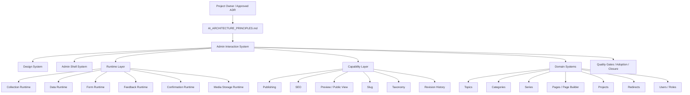
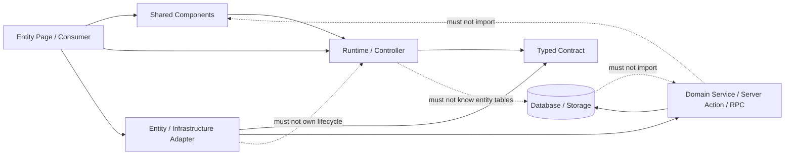
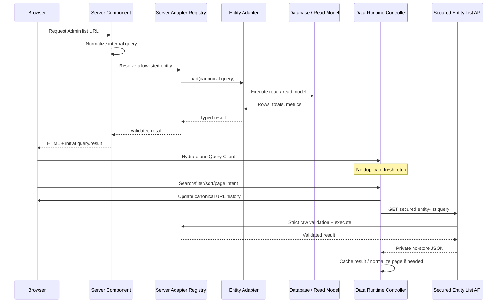
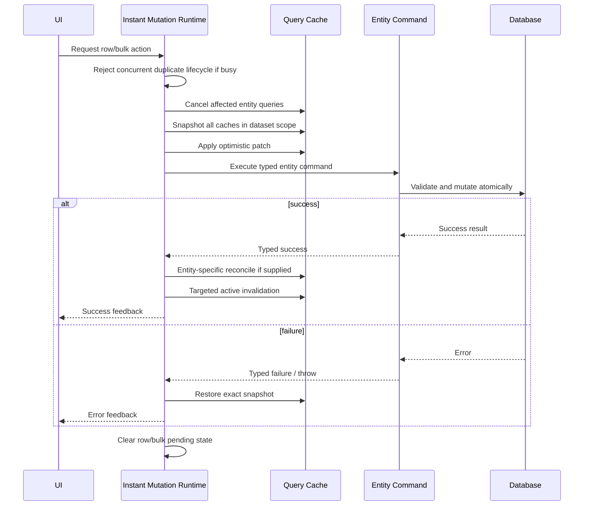
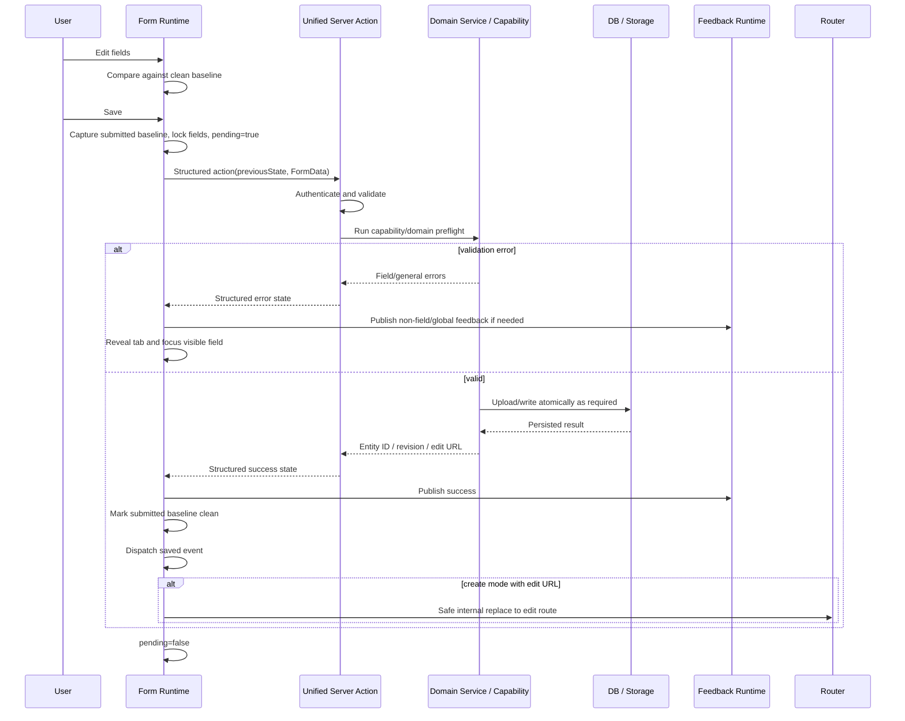
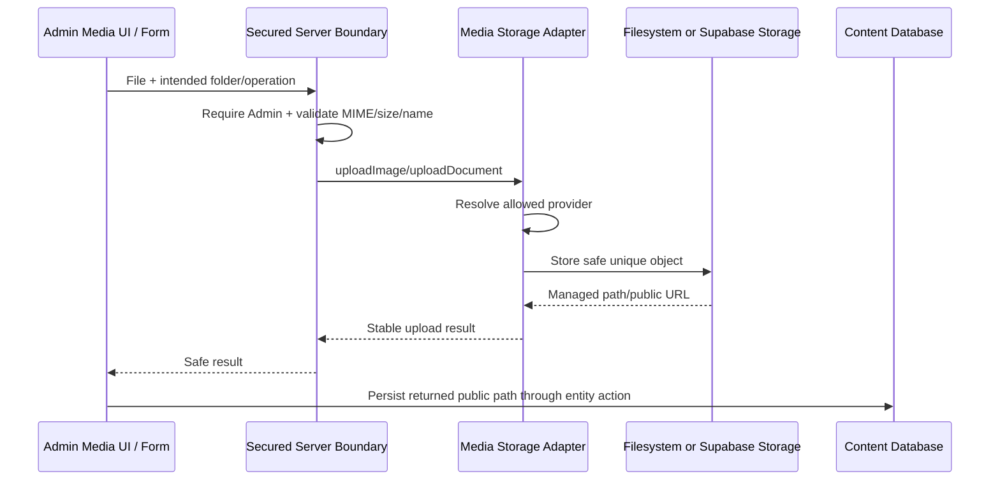
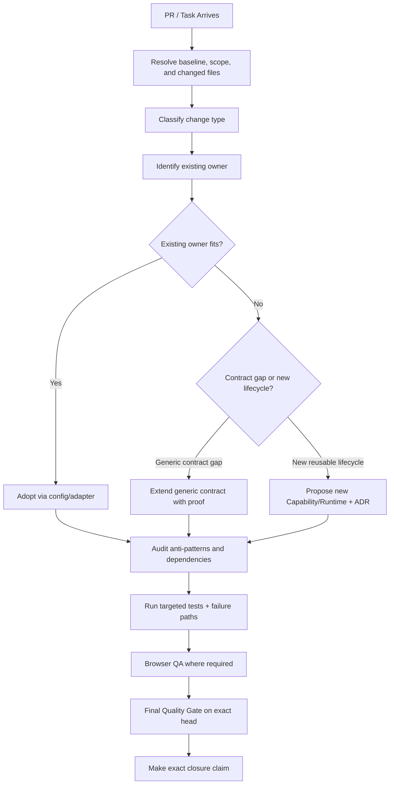

# Venesia CMS — AI Architecture Principles

> **The Official Architecture Constitution for Venesia Website/CMS**
> **Document:** `AI_ARCHITECTURE_PRINCIPLES.md`
> **Status:** Official, normative, and project-wide
> **Version:** 3.0.0
> **Effective date:** 2026-07-24
> **Repository:** `ahmedredasadan100/venesia-website`
> **Architecture authority:** Project Owner / approved architecture decision
> **Supersedes:** *Venesia CMS — Official Architecture Principle (Version 1.0)* and every shorter or conflicting architecture summary

> **اعتماد رسمي**
> هذه الوثيقة هي المرجع المعماري الأعلى والوحيد لمشروع Venesia Website/CMS. أي تنفيذ يخالفها لا يُعتبر صحيحًا معماريًا لمجرد أن الكود يعمل. عند وجود تعارض بين هذه الوثيقة وبين تنفيذ قديم أو ملخص سابق، يجب إظهار التعارض صراحةً، وعدم بناء حل موازٍ أو تجاوز القاعدة في صمت.

---

## Table of Contents

1. [Authority, Purpose, and Scope](#1-authority-purpose-and-scope)
2. [Normative Language and Source-of-Truth Order](#2-normative-language-and-source-of-truth-order)
3. [Architecture Vision](#3-architecture-vision)
4. [Core Constitutional Principles](#4-core-constitutional-principles)
5. [Official Definitions](#5-official-definitions)
6. [Architecture Map and Dependency Direction](#6-architecture-map-and-dependency-direction)
7. [System and Runtime Catalogue](#7-system-and-runtime-catalogue)
8. [Runtime Boundary Matrix](#8-runtime-boundary-matrix)
9. [Capability Architecture](#9-capability-architecture)
10. [Entity Rules](#10-entity-rules)
11. [Adapter Rules](#11-adapter-rules)
12. [Shared Component Rules](#12-shared-component-rules)
13. [Contracts, Validation, and State Ownership](#13-contracts-validation-and-state-ownership)
14. [Client, Server, Database, and Storage Boundaries](#14-client-server-database-and-storage-boundaries)
15. [Canonical Collection Read Flow](#15-canonical-collection-read-flow)
16. [Canonical Instant Mutation Flow](#16-canonical-instant-mutation-flow)
17. [Canonical Form Flow](#17-canonical-form-flow)
18. [Canonical Media Flow](#18-canonical-media-flow)
19. [Adoption Rules](#19-adoption-rules)
20. [Exception and Debt Model](#20-exception-and-debt-model)
21. [Forbidden Architectural Patterns](#21-forbidden-architectural-patterns)
22. [Security and Data-Integrity Rules](#22-security-and-data-integrity-rules)
23. [Performance and User-Experience Invariants](#23-performance-and-user-experience-invariants)
24. [Accessibility, RTL, and Responsive Rules](#24-accessibility-rtl-and-responsive-rules)
25. [Testing and Quality Gates](#25-testing-and-quality-gates)
26. [True Closure Rules](#26-true-closure-rules)
27. [PR Architecture Checklist](#27-pr-architecture-checklist)
28. [AI Execution Rules](#28-ai-execution-rules)
29. [Architecture Review Flow](#29-architecture-review-flow)
30. [Official Architecture Decision Records](#30-official-architecture-decision-records)
31. [Current State Is External](#31-current-state-is-external)
32. [Canonical Documentation System](#32-canonical-documentation-system)
33. [Document Governance](#33-document-governance)
34. [Golden Rules](#34-golden-rules)
35. [Appendix A — Required Templates](#35-appendix-a--required-templates)
36. [Appendix B — Evidence Sources and State Update Policy](#36-appendix-b--evidence-sources-and-state-update-policy)
37. [Appendix C — Fast Architecture Review Questions](#37-appendix-c--fast-architecture-review-questions)
38. [Changelog](#38-changelog)

---

# 1. Authority, Purpose, and Scope

## 1.1 Authority

This file is the highest architecture authority inside the Venesia Website/CMS repository.

Its purpose is not to describe every file. Its purpose is to define the rules that decide whether a file, feature, refactor, migration, runtime, adapter, capability, pull request, or AI-generated implementation belongs to the Venesia architecture.

A change is not architecture-compliant merely because:

- it compiles;
- it passes one local test;
- it renders correctly in one browser;
- it is faster than the previous implementation;
- it uses a modern library;
- it was produced by a strong AI model;
- it solves the immediate screen;
- it was already merged in an older phase.

A change is architecture-compliant only when it:

1. preserves the ownership model defined here;
2. uses the existing System, Runtime, Capability, Contract, and Adapter boundaries;
3. avoids duplicate sources of truth;
4. declares exceptions and debt truthfully;
5. proves behavior through the required quality gates;
6. makes only the closure claim supported by the evidence.

## 1.2 Purpose

This constitution exists to keep Venesia CMS coherent while the project grows.

It is written for:

- Codex;
- Cursor;
- any other AI coding agent;
- senior and junior developers;
- reviewers;
- future maintainers;
- the Project Owner;
- any team that later extends the CMS or introduces adjacent bounded contexts.

Every agent or developer MUST read this file before proposing architecture-changing code.

## 1.3 Scope

This constitution governs:

- the Venesia public website where its architecture intersects with CMS data and contracts;
- the Admin platform;
- Admin Shell and navigation;
- collection/list behavior;
- data loading and instant mutations;
- forms and form lifecycle;
- feedback and confirmation;
- media storage and media administration;
- content taxonomy;
- topic editing, SEO, publishing, and review workflows;
- pages and page-builder administration;
- projects administration;
- migrations, server actions, API routes, database RPCs, and storage adapters;
- architecture tests, Browser QA, CI, PR closure, and deployment evidence.

## 1.4 Out of Scope Unless Explicitly Approved

The following are not automatically part of this CMS architecture:

- a full CRM;
- units, owners, availability, reservations, contracts, installments, or collections;
- accounting or financial ledgers;
- a generic multi-tenant SaaS platform;
- public API productization;
- native mobile applications;
- a second Admin platform;
- a second CMS runtime.

If a CRM is introduced later, it MUST be treated as a separate bounded context with explicit integration contracts. It MUST NOT be inserted into CMS runtimes by expanding them into “everything engines.”

## 1.5 What This Document Replaces

This document replaces the earlier principle that said, in summary:

- there is one Admin Interaction System;
- behavior is distributed across specialized runtimes;
- capabilities are implemented once and adopted;
- entities declare capabilities;
- shared components display results;
- stages close systems or capabilities, not screens.

Those principles remain valid, but this file formalizes them, adds ownership rules, execution flows, exception handling, quality gates, AI behavior, PR review, closure levels, state separation, and architecture governance.

---

# 2. Normative Language and Source-of-Truth Order

## 2.1 Normative Keywords

The following words are used deliberately:

- **MUST / MUST NOT** — mandatory architecture rule. Violation requires correction or an approved ADR.
- **SHOULD / SHOULD NOT** — expected default. Deviation requires a stated reason and evidence.
- **MAY** — permitted, not required.
- **PROHIBITED** — invalid architecture unless the Project Owner approves a new ADR.
- **CLOSED** — closure criteria for the declared scope are proven on the exact code state.
- **REFERENCE-CONSUMER CLOSED** — the shared contract is proven by canonical consumers; global adoption is not implied.
- **GLOBAL CLOSED** — all in-scope consumers are adopted or explicitly classified and approved, with no undeclared generic gaps.

## 2.2 Source-of-Truth Order

When sources disagree, use this order:

1. **An explicit current decision by the Project Owner**, when it clearly acknowledges the architecture impact.
2. **An approved Architecture Decision Record in this file or a linked dedicated ADR.**
3. **This constitution.**
4. **Typed contracts, adoption manifests, and architecture guards in the repository.**
5. **Current verified implementation and migrations.**
6. **Current tests and quality-gate scripts.**
7. **Merged PR descriptions and closure reports.**
8. **Other documentation.**
9. **Old chat summaries, old screenshots, assumptions, or model memory.**

A current task instruction does not silently erase an architecture rule. If it conflicts, the agent MUST surface the conflict and either:

- implement a compliant interpretation;
- request or record an architecture decision when the conflict is material;
- stop only when continuing would risk data, security, or irreversible architecture damage.

## 2.3 Code Is Evidence, Not Automatic Authority

Existing code may contain legacy behavior, debt, or incomplete adoption. Therefore:

- “the code already does it” is not sufficient justification;
- “another screen copied it” is evidence of possible duplication, not a standard;
- an old component name does not define current ownership;
- an existing local implementation does not become a shared capability merely through repetition.

## 2.4 Documentation Must Not Overclaim

Architecture documentation MUST distinguish between:

- the desired constitutional model;
- what is implemented on `main`;
- what exists only on an active branch or Draft PR;
- what is partially adopted;
- what is explicitly deferred;
- what is an approved exception;
- what remains debt.

No document may convert “partial,” “reference,” “draft,” or “locally verified” into “globally closed,” “merged,” or “production complete.”

---

# 3. Architecture Vision

## 3.1 The Core Vision

Venesia CMS is one coherent Admin platform, not a collection of unrelated screens.

The Admin platform is organized as one architectural umbrella — the **Admin Interaction System** — implemented through specialized Systems, Runtimes, Capabilities, Contracts, Adapters, and Shared Components.

The architecture is designed so that a future change happens in the correct owner once and then reaches every adopter through the contract.

Examples:

- Changing feedback policy should update all consumers of the Feedback Runtime.
- Changing unsaved-change behavior should update all generic forms that adopt the Form Runtime.
- Changing list pagination or filter URL rules should update every collection using the Collection Runtime.
- Changing cache rollback behavior should update every entity using the Instant Data Runtime.
- Changing production upload provider rules should update every media consumer through the Media Storage Adapter.

The project MUST NOT require editing each screen for a cross-cutting behavior that already has a shared owner.

## 3.2 The Architecture Equation

The architecture is summarized by this equation:

> **Entities declare domain data and supported capabilities.**
> **Runtimes own reusable lifecycle and behavior.**
> **Capabilities own reusable product functions.**
> **Adapters translate entity-specific boundaries.**
> **Shared Components render and collect user intent.**
> **Systems organize the whole contract, tests, and governance.**

## 3.3 The Objective

The objective is not maximum abstraction.

The objective is:

- one owner for each reusable behavior;
- explicit domain boundaries;
- no hidden duplicate systems;
- safe data operations;
- instant and predictable Admin interactions;
- truthful closure;
- code that AI agents can extend without guessing.

## 3.4 The Balance

Two opposite failures are prohibited:

### Failure A — Local duplication

Every screen owns its own:

- fetch behavior;
- pending state;
- save flow;
- feedback;
- confirmation;
- cache updates;
- route state;
- upload logic.

This creates inconsistent behavior and multiplies defects.

### Failure B — The God Runtime

One enormous runtime knows:

- every entity;
- every table;
- every route;
- every permission;
- every form;
- every list;
- every publishing rule;
- every page-builder workflow.

This creates coupling, fear of change, and impossible testing.

Venesia chooses the middle path:

> **One system, specialized owners, explicit contracts, thin adapters, declared adoption.**

## 3.5 Architecture Before Feature Convenience

When immediate convenience conflicts with system integrity, architecture wins.

A one-hour local patch that creates a second owner can cost weeks later. The correct question is not only:

> “Does this fix the screen?”

The required questions are:

> “Who owns this behavior?”
> “Does an existing Runtime or Capability already exist?”
> “Is this screen an adopter, an exception, or evidence of a missing contract?”
> “Will the next entity reuse this implementation without copying it?”

---

# 4. Core Constitutional Principles

## 4.1 One Admin Interaction System

There is one Admin Interaction System.

It contains specialized systems and runtimes. It does not permit parallel Admin platforms or duplicate behavior engines.

## 4.2 One Runtime, One Responsibility

Each Runtime MUST own one coherent lifecycle concern.

Examples:

- Collection Runtime — collection interaction state.
- Data Runtime — fetching, caching, invalidation, cancellation, optimistic mutation, rollback.
- Form Runtime — form submission lifecycle, dirty state, pending, structured errors, save/close, create-to-edit handoff, field focus.
- Feedback Runtime — feedback publication, channels, lifecycle, deduplication, viewport.
- Confirmation Runtime — destructive confirmation, focus trap, pending safety, focus return.

A Runtime MUST NOT absorb a second lifecycle merely because both are used on the same screen.

## 4.3 Build Once, Adopt Everywhere

A reusable Runtime or Capability is built once.

New entities adopt the contract; they do not rebuild the behavior.

Adoption may require an Adapter. It does not justify a parallel Runtime.

## 4.4 One Capability, One Owner

A reusable product function has one owner implementation.

Examples of capability candidates include:

- Preview;
- Public View;
- Publishing;
- SEO;
- Media;
- Slug;
- Taxonomy;
- Revision History;
- Visibility;
- Localization;
- Permissions.

A repeated feature is not automatically a capability. It becomes an official capability only after it has:

1. a name;
2. an owner;
3. a typed contract;
4. failure semantics;
5. an adoption model;
6. tests;
7. an explicit status.

## 4.5 Entities Declare; Shared Owners Execute

An Entity owns domain-specific data and invariants.

An Entity MUST NOT own reusable interaction lifecycle that belongs to a Runtime.

A Topic may declare that it supports publishing. A Topic screen must not create a new publishing engine if a shared Publishing Capability exists.

## 4.6 Shared Components Display; They Do Not Own Business Logic

Shared Components MAY:

- render data;
- expose visual variants;
- collect user intent;
- call Runtime context methods;
- display validation and feedback supplied through contracts;
- implement accessibility and visual behavior.

Shared Components MUST NOT:

- query domain tables;
- know entity-specific database rules;
- decide publication eligibility;
- perform multi-table mutations;
- contain hard-coded entity routes when a contract can supply them;
- become hidden service layers.

## 4.7 Adapters Translate; They Do Not Become Runtimes

Adapters exist at boundaries.

They MAY translate:

- entity query parameters into a generic collection query contract;
- database rows into runtime result schemas;
- entity-specific fields into shared component options;
- domain actions into shared mutation result contracts;
- storage provider details into media operations.

Adapters MUST NOT duplicate:

- pending lifecycle;
- dirty tracking;
- URL state orchestration;
- feedback policy;
- optimistic mutation orchestration;
- confirmation lifecycle;
- retry policy.

## 4.8 Strict Boundaries, Safe Normalization

External request boundaries MUST validate raw input strictly.

Internal rendering or URL restoration MAY normalize to canonical defaults where that behavior is explicitly part of the contract.

Invalid external input MUST NOT be silently transformed into a different valid request.

## 4.9 One Source of Truth per State

Every state has one owner.

Examples:

- canonical collection query state — Collection/Data Runtime contract;
- collection cache — TanStack Query client owned by the Admin provider;
- generic form pending and dirty state — Form Runtime;
- persistent global action feedback — Feedback Runtime;
- destructive dialog open/pending/focus state — Confirmation Runtime;
- entity domain truth — server/database;
- media provider selection — Media Storage Adapter policy.

Mirrored state is allowed only when synchronization is explicit and proven.

## 4.10 Proof Before Closure

A phase closes a System, Runtime, Capability, adoption tranche, or reference contract — not merely a screen.

“Topic screen works” is not a global Form Runtime closure claim.

“Pages adopted the Data Runtime” is not proof that every Admin list has adopted it.

Closure language MUST exactly match proven scope.

## 4.11 Truthful Exceptions

Specialized workflows may remain outside a generic runtime when their lifecycle is materially different.

They MUST be declared as exceptions. They MUST NOT be silently ignored or mislabeled as adopted.

## 4.12 No Architecture by Accident

A new Runtime, System, global provider, registry, persistence mechanism, or database abstraction MUST be deliberate.

It requires an architecture impact statement and, when material, an ADR.

## 4.13 No Destructive Surprise

Migrations, storage changes, auth changes, permissions changes, and data backfills MUST be explicit, additive where possible, reviewed, and proven.

## 4.14 Accessibility Is a Contract

Focus, keyboard access, RTL, responsive behavior, pending states, error navigation, and reduced-motion behavior are architecture requirements, not final visual polish.

## 4.15 The Golden Principle

> **A cross-cutting change must have one correct owner and one adoption path.**

---

# 5. Official Definitions

## 5.1 System

A **System** is an architectural umbrella that defines a coherent product area.

A System includes some or all of:

- purpose;
- boundaries;
- Runtimes;
- Capabilities;
- contracts;
- shared components;
- adapters;
- registries;
- tests;
- quality gates;
- adoption state;
- documentation;
- closure rules.

A System is not necessarily one class, one folder, or one provider.

**Example:** `Admin Interaction System`.

## 5.2 Runtime (Motor)

A **Runtime** is a reusable behavior owner that executes a lifecycle at runtime.

A Runtime:

- owns state transitions for one concern;
- exposes a contract to consumers;
- coordinates shared behavior;
- delegates entity-specific data or domain work through adapters/actions;
- remains independent from visual layout and entity-specific rules.

A Runtime is not a generic name for any utility.

**Examples:** Collection Runtime, Data Runtime, Form Runtime, Feedback Runtime, Confirmation Runtime.

## 5.3 Capability

A **Capability** is a reusable product function that an Entity or workflow may support.

A Capability has one implementation owner and can be adopted by multiple consumers.

A Capability may use one or more Runtimes, but it is not itself automatically a Runtime.

**Example:** Publishing may use Form Runtime, Confirmation Runtime, Feedback Runtime, and domain validation, while still being one Publishing Capability.

## 5.4 Entity

An **Entity** is a domain concept with identity, data, invariants, and lifecycle.

Examples:

- Topic;
- Category;
- Series;
- Page;
- Project;
- Redirect;
- Media Asset;
- Menu;
- User.

An Entity may declare supported capabilities and supply adapters. It does not own shared runtime behavior.

## 5.5 Consumer

A **Consumer** is a page, editor, table, modal, route, or workflow that uses a System, Runtime, or Capability.

A consumer can be:

- fully adopted;
- partially adopted;
- a reference consumer;
- a legacy generic gap;
- a specialized exception;
- an explicit exception.

## 5.6 Reference Consumer

A **Reference Consumer** is the canonical implementation used to prove that a shared contract is complete enough for real use.

It should exercise the difficult parts of the contract, not only the happy path.

Reference-consumer closure proves the shared contract and named consumers. It does not prove global adoption.

## 5.7 Shared Component

A **Shared Component** is reusable presentation and interaction UI.

It may know:

- design tokens;
- accessibility behavior;
- component state local to presentation;
- Runtime context;
- generic props and events.

It must not know:

- domain table semantics;
- entity-specific mutation rules;
- private credentials;
- unrelated workflow lifecycle.

## 5.8 Adapter

An **Adapter** translates one boundary into another without owning the whole lifecycle.

Examples:

- Entity List Adapter translates entity-specific query/load/result logic into the shared Data Runtime contract.
- Media Storage Adapter translates filesystem or Supabase Storage into one media contract.
- UI option adapters translate entity records into listbox options.

## 5.9 Contract

A **Contract** is a typed, validated, testable boundary.

A contract defines:

- accepted inputs;
- normalized shape;
- output shape;
- errors;
- state transitions;
- allowed optional behavior;
- security expectations;
- compatibility guarantees.

A TypeScript type alone is not enough when runtime input can be untrusted. Runtime validation is required at external and persistence boundaries.

## 5.10 Registry

A **Registry** is an explicit allowlist of implementations or adopters.

A Registry MUST:

- be typed;
- reject unknown keys;
- avoid dynamic arbitrary imports from request input;
- remain at the composition boundary;
- expose only approved implementations.

## 5.11 Controller / Orchestrator

A **Controller** or **Orchestrator** coordinates a Runtime’s state transitions.

It may:

- update canonical query state;
- call a shared endpoint;
- cancel requests;
- reconcile normalized results;
- expose commands to UI.

It must not absorb domain rules that belong to an Entity service or Capability.

## 5.12 Provider

A **Provider** supplies shared runtime state or infrastructure to a subtree.

A Provider must be created at a stable boundary, not recreated per row or per interaction.

**Examples:** Query Client Provider, Feedback Provider.

## 5.13 Query

A **Query** is a read operation that does not intentionally mutate domain state.

A collection query includes canonical search, filters, sort, page, page size, and mode.

## 5.14 Command / Mutation

A **Command** or **Mutation** intentionally changes state.

It MUST have:

- authorization;
- validation;
- clear success/error shape;
- idempotency or duplicate-submission protection where necessary;
- data-integrity rules;
- feedback behavior;
- cache reconciliation or invalidation.

## 5.15 Read Model

A **Read Model** is an optimized server/database representation for a specific read contract.

It may aggregate multiple tables or counts in one operation. It must not become an undocumented parallel source of business truth.

## 5.16 State

**State** is data that changes over time and influences behavior or rendering.

Every state must have an owner and lifecycle. State without a declared owner is architecture debt.

## 5.17 Lifecycle

A **Lifecycle** is the sequence of states and transitions for one concern.

Examples:

- idle → pending → success/error;
- clean → dirty → confirm leave → close;
- cached → optimistic patch → server success → reconciliation;
- cached → optimistic patch → server failure → rollback.

## 5.18 Single Source of Truth

A **Single Source of Truth** is the sole authoritative owner for a fact or state within a declared boundary.

It does not mean every layer stores nothing. It means copies derive from and reconcile with one authority.

## 5.19 Adoption

**Adoption** is the act of making a consumer use an existing shared contract without duplicating its behavior.

Adoption is not a rename. It requires the legacy owner to be removed or explicitly retained as an exception.

## 5.20 Adoption Manifest

An **Adoption Manifest** is a machine-readable ledger that classifies every in-scope consumer and prevents silent gaps.

Each source owner should be classified exactly once.

## 5.21 Generic Gap

A **Generic Gap** is a consumer whose lifecycle fits a shared Runtime but has not adopted it yet.

A generic gap blocks global closure.

## 5.22 Specialized Exception

A **Specialized Exception** is a workflow whose lifecycle materially differs from the generic contract.

It is not automatically permanent. It requires a dedicated contract analysis before adoption or a specialized Runtime is approved.

## 5.23 Explicit Exception

An **Explicit Exception** is a deliberately excluded operation that does not represent the lifecycle governed by the Runtime.

Examples may include login forms, one-shot row commands, or immediate toggles.

## 5.24 Architecture Debt

**Architecture Debt** is known non-compliance, incomplete adoption, migration provenance uncertainty, native browser confirmation, duplicate ownership, or another gap that is explicitly recorded for future correction.

Undeclared debt is a defect.

## 5.25 Baseline

A **Baseline** is the exact Git commit from which a phase is evaluated.

A baseline is not “latest main” as a vague phrase. It is a SHA.

## 5.26 Quality Gate

A **Quality Gate** is a repeatable set of checks that proves technical and architectural conditions on an exact code state.

## 5.27 Browser QA

**Browser QA** is behavior validation in a real browser session, including responsive and interaction flows that static checks cannot prove.

## 5.28 Closure

**Closure** is an evidence-backed status for a precisely named scope.

Closure is invalid when:

- the claim is broader than the inventory;
- the exact head was not tested;
- required migrations are uncertain;
- known generic gaps are hidden;
- cleanup was not proven;
- the PR is still Draft or unmerged when merge is part of the claim.

## 5.29 Architecture Decision Record (ADR)

An **ADR** records a material architecture choice, its context, decision, consequences, and status.

An ADR is required when introducing or materially changing:

- a System;
- a Runtime;
- a global provider;
- a core capability owner;
- a data/storage provider;
- a cross-system dependency direction;
- a closure definition;
- a security boundary.

---

# 6. Architecture Map and Dependency Direction

## 6.1 Top-Level Map



The diagram expresses ownership categories. It does not claim that every listed capability is globally implemented or closed. Current maturity is documented later.

## 6.2 Canonical Dependency Direction



## 6.3 Allowed Dependency Rules

### Consumers MAY depend on:

- shared UI components;
- runtime hooks/providers;
- entity contracts;
- entity adapters;
- entity server actions or capability entry points.

### Shared Components MAY depend on:

- design tokens;
- generic UI utilities;
- runtime context;
- generic contract types.

### Runtimes MAY depend on:

- generic contracts;
- generic utilities;
- shared providers;
- framework primitives;
- typed callbacks supplied by consumers.

### Adapters MAY depend on:

- generic runtime contracts;
- entity-specific services;
- runtime validators;
- server-only database or storage clients when the adapter is server-side.

### Domain Services MAY depend on:

- domain validators;
- database clients;
- storage adapters;
- audit utilities;
- server-only auth context;
- database RPCs.

## 6.4 Prohibited Dependency Rules

The following are prohibited:

- Shared Component → entity database action.
- Runtime → hard-coded entity table.
- Runtime → entity-specific page component.
- Client Component → service-role Supabase client.
- Storage Adapter → Admin UI.
- Domain Service → React component.
- Entity Adapter → duplicated cache lifecycle.
- System A → System B → System A circular dependency.
- Request input → arbitrary adapter import.
- Shared Core → route-specific strings when a contract can supply them.

## 6.5 Composition Roots

Composition roots are the limited locations where systems are assembled.

Current representative composition roots include:

- Admin layout/access composition;
- typed navigation configuration;
- server-only Entity List adapter registry;
- Query Client Provider;
- Feedback Provider;
- entity pages that bind adapters/contracts to shared runtimes.

A composition root may know multiple implementations. The implementations themselves should not know each other unnecessarily.

## 6.6 Representative Repository Boundaries

The following current paths are architecture evidence, not permanent folder-law:

| Concern | Representative owner path |
|---|---|
| Admin Shell contracts | `src/lib/admin/shell/` |
| Admin navigation configuration | `src/config/admin/` |
| Admin Shell UI | `src/components/admin/AdminShell.tsx` |
| Admin collection UI | `src/components/admin/entity-list/` |
| Data Runtime | `src/lib/admin/entity-list/data-engine/` |
| Entity List adapters | `src/lib/admin/**/entity-list-adapter*` and content adapter folders |
| Entity List API boundary | `src/app/api/admin/entity-lists/[entity]/route.ts` |
| Form contract | `src/lib/admin/form-runtime.ts` |
| Form Runtime UI/orchestration | `src/components/admin/ui/AdminFormRuntime.tsx` |
| Form adoption ledger | `src/lib/admin/form-system/adoption-manifest.ts` on the active Form closure branch |
| Feedback Runtime | `src/components/admin/AdminFeedbackProvider.tsx` |
| Confirmation Runtime | `src/components/admin/ui/AdminConfirmDialog.tsx` |
| Media storage contract | `src/lib/admin/media-storage-adapter.ts` |
| Taxonomy domain mutations | `src/lib/admin/content/taxonomy-mutations.ts` |
| Architecture and contract gates | `scripts/verify-*`, `scripts/qa-*` |
| Database changes | `sql/migrations/` |

A future reorganization MAY change paths, but MUST preserve ownership and update this document or the relevant ADR.

---
# 7. System and Runtime Catalogue

This section defines official ownership. It distinguishes a System from the Runtime or Capability it contains.

## 7.1 Design System

### Type

System / presentation foundation.

### Purpose

Provide a coherent, accessible, RTL-ready, responsive visual language for the Admin platform.

### Owns

- visual tokens;
- typography;
- spacing;
- colors;
- surfaces;
- buttons;
- inputs;
- switches;
- listboxes;
- cards;
- tables and data-grid presentation;
- modal presentation;
- icons;
- empty/loading/error visual states;
- responsive layout primitives;
- focus visuals;
- reduced-motion behavior where applicable.

### Must Not Own

- database access;
- entity business rules;
- publication eligibility;
- cache invalidation;
- multi-table mutations;
- route-specific data loading;
- permission decisions;
- form persistence lifecycle;
- list query lifecycle.

### Adoption Rule

When a visual pattern repeats, extend the existing component through a generic prop or variant where the variation is genuinely reusable. Do not create entity-named shared components for differences that can be represented as configuration.

### Valid Example

A generic listbox receives options, labels, disabled state, search behavior, and accessibility identifiers through props.

### Invalid Example

A shared listbox imports Category actions, queries the `categories` table, or contains Topic-specific validation.

---

## 7.2 Admin Shell System

### Type

System.

### Purpose

Provide the stable frame in which authenticated Admin experiences run.

### Current Responsibilities

- Sidebar;
- responsive drawer;
- header;
- breadcrumb/context header;
- page layout;
- typed navigation registry;
- active-route resolution;
- safe navigation prefetch behavior;
- persisted sidebar collapse state;
- company identity resolution;
- public website link;
- Admin Page Header states;
- authentication-route exclusion from the normal shell.

### Current Contract Evidence

The Shell contract includes typed company identity, configuration source, navigation items, module keys, order, enabled state, nested children, badges, and a permission descriptor that preserves current Admin access.

### Must Not Own

- form save behavior;
- table filtering or pagination;
- entity mutations;
- entity metrics;
- page-builder rules;
- publishing;
- storage uploads;
- domain-specific permissions unless a separate Permissions System is approved.

### Company Identity Resolution

Company identity may resolve from:

1. database configuration;
2. company defaults;
3. a safe fallback.

The resolved source MUST remain observable in the contract. Silent fallback is prohibited where it would hide a configuration defect.

### Closure Status

The constitution defines the Shell owner and boundary. Current closure and adopter state belong in `docs/CURRENT_PROJECT_STATE.md`, current code, and the applicable guards. A prior closure never permits a second Shell.

---

## 7.3 Collection Runtime

### Type

Runtime within the Admin Entity List System.

### Purpose

Own generic collection interaction behavior independently from data-source details.

### Owns

- search intent;
- filters;
- sorting intent;
- pagination intent;
- page-size intent;
- selection;
- row-action presentation contract;
- bulk-action presentation contract;
- column visibility;
- column preference persistence interaction;
- empty-state resolution;
- feedback placement inside collection context;
- URL-state integration at the shared contract boundary;
- floating-layer interaction for collection controls.

### Must Not Own

- SQL queries;
- Supabase table names;
- entity-specific row mapping;
- publication or deletion rules;
- server cache implementation;
- storage;
- form dirty state;
- confirmation policy for unrelated workflows.

### Relationship to Data Runtime

The Collection Runtime expresses what the user wants to view or act on.

The Data Runtime decides how data is fetched, cached, cancelled, patched, rolled back, and invalidated.

These responsibilities are related but not interchangeable.

### Consumer Evidence

Current consumers and adapter registrations MUST be read from the current registry, adoption inventory, guards, and `docs/CURRENT_PROJECT_STATE.md`.

This constitution deliberately does not freeze a volatile adopter list. No consumer list may be inferred as globally complete without a current inventory.

---

## 7.4 Data Runtime — Admin Instant Data Engine

### Type

Runtime.

### Purpose

Provide a canonical, secure, fast, typed data lifecycle for Admin collections.

### Owns

- canonical collection query shape;
- strict raw request validation;
- internal query normalization;
- stable serialized query keys;
- one Query Client at the Admin boundary;
- RSC initial-data hydration;
- client fetch lifecycle;
- request cancellation;
- retry policy;
- stale time;
- `keepPreviousData` behavior;
- normalized out-of-range page reconciliation;
- exact cache snapshots;
- optimistic patches;
- dataset-scope matching;
- rollback;
- targeted invalidation;
- row and bulk pending state;
- typed request errors;
- result-schema validation;
- adapter registry execution;
- performance instrumentation at the API boundary.

### Current Canonical Query

The generic collection query includes:

- `search`;
- `filters`;
- `sort`;
- `page`;
- `pageSize`;
- `mode` (`server-page` or `bounded-client`).

### Strict External Boundary

The API boundary MUST:

- reject unknown parameters;
- reject repeated owned parameters;
- reject invalid page and limit values;
- reject unsupported sort values;
- reject invalid raw filters;
- return a stable `400 invalid_query` response;
- never silently reinterpret malformed external input as a different request.

### Internal Normalization

Server rendering and history restoration MAY normalize valid-but-noncanonical state to defaults or a normalized page. This internal normalization is separate from raw request validation.

### Registry Rule

The server-only adapter registry is an allowlist. Unknown entity keys MUST return `404` and MUST NOT drive dynamic arbitrary imports.

### Cache-Scope Rule

For optimistic row removal and total updates, dataset membership is defined by:

- entity;
- search;
- filters;
- mode.

The following are view parameters and do not define dataset membership:

- page;
- sort;
- page size.

Therefore a successful delete can update totals across cached views in the same dataset while preserving unrelated search/filter/mode scopes.

### Safe Upsert Rule

Generic optimistic reconciliation MAY replace rows where they already exist.

It MUST NOT blindly insert a new row into arbitrary sorted or paginated caches because the correct destination cannot be inferred generically. New-record placement requires targeted invalidation or an entity-specific proven reconciliation contract.

### Must Not Own

- visual table layout;
- form lifecycle;
- entity domain validation;
- raw SQL embedded in the generic runtime;
- entity route copy;
- authorization policy beyond invoking the secured boundary;
- page-builder composition.

### Closure Status

The constitution defines the Data Runtime contract. Current foundation, reference-consumer, adoption-tranche, and global status MUST be proven from the exact current code, manifests, guards, tests, and `docs/CURRENT_PROJECT_STATE.md`.

---

## 7.5 Form Runtime

### Type

Runtime.

### Purpose

Own the generic create/edit form lifecycle.

### Generic Form Runtime Responsibilities

- create/edit mode;
- action state;
- pending state;
- full-field pending lock;
- dirty baseline;
- unsaved-change detection;
- internal-link leave interception;
- browser unload protection;
- Save action;
- Close action;
- Save/Close ordering and responsive behavior;
- structured server errors;
- field-error mapping;
- tab and field reveal/focus;
- feedback publication through a dedicated channel;
- successful-save clean baseline;
- Create → Edit handoff;
- safe internal navigation;
- form-saved event for dependent local concerns such as draft cleanup.

### Canonical Action State

The structured action state includes, where relevant:

- status (`idle`, `error`, `success`);
- mode (`create`, `edit`);
- revision;
- message and title;
- stable error code;
- entity ID;
- safe edit URL;
- saved revision token;
- focus target;
- tab target;
- field errors.

### Generic Form Invariants

1. There MUST be one real `<form>` owner for a generic entity create/edit surface.
2. The shared Runtime MUST own pending and dirty state.
3. Consumer fields MUST be disabled during save or Create → Edit handoff.
4. Generic form actions MUST return structured state.
5. The Runtime, not the server action, SHOULD perform safe in-app Create → Edit navigation.
6. Generic reference actions are exactly Save and Close.
7. Additional behavior such as publishing MUST be represented as an approved Capability or optional form field when it belongs to the same atomic save.
8. Field errors MUST reveal the actual visible control, including controls implemented through accessible listboxes.
9. A successful save MUST mark the submitted state clean, not an arbitrary later state.
10. A consumer MUST NOT mount a second parallel SaveBar engine.

### Form Data Ownership

Any Admin source that owns a raw `<form>` or imperative `new FormData(...)` is a form mutation owner and MUST be classified in the Form adoption ledger.

### Generic vs Specialized

A specialized builder is not forced into the generic Form Runtime merely because it contains fields.

However, “specialized” cannot be used as a vague escape. The workflow must demonstrate materially different lifecycle needs, such as:

- multi-node composition;
- drag/drop ordering;
- independently persisted subresources;
- schema-driven block construction;
- security/session semantics;
- one-shot commands without a persistent editable session.

### Closure Status

Current reference consumers, generic gaps, specialized exceptions, and global-closure truth MUST come from the current adoption manifest, architecture guard, exact code state, and `docs/CURRENT_PROJECT_STATE.md`.

Reference-consumer proof never implies global closure.

---

## 7.6 Feedback Runtime

### Type

Runtime.

### Purpose

Provide consistent action feedback across Admin workflows.

### Owns

- feedback entries;
- channels;
- publication;
- dismissal;
- channel clearing;
- duplicate-signature reconciliation;
- transient vs persistent lifecycle;
- critical classification;
- viewport placement;
- focus behavior for critical feedback;
- stacking limits;
- interactive action links/buttons inside pass-through viewports.

### Canonical Feedback Shape

Feedback includes:

- variant (`success`, `warning`, `danger`, `info`);
- title;
- message;
- layout (`inline`, `stacked`);
- dismissible flag;
- lifecycle (`manual`, `persistent`);
- optional URL cleanup parameters;
- optional repair/action link.

### Policy

- routine success feedback should not accumulate indefinitely;
- critical persistent errors may coexist and remain visible;
- duplicate feedback in the same channel should reconcile rather than spam;
- field-level validation should remain at fields when global duplication would add noise;
- actionable feedback must preserve pointer access and keyboard access;
- mobile placement must not cover sticky form actions.

### Must Not Own

- mutation execution;
- data rollback;
- domain validation;
- form dirty state;
- navigation policy beyond optional action links supplied by contracts.

---

## 7.7 Confirmation Runtime

### Type

Runtime / shared interaction owner.

### Purpose

Provide safe confirmation for destructive or irreversible actions.

### Owns

- dialog rendering through a portal;
- accessible dialog semantics;
- title and description association;
- initial focus;
- focus trap;
- Escape behavior;
- backdrop behavior;
- body scroll lock;
- focus return;
- pending lock;
- duplicate invocation protection;
- confirm/cancel interaction.

### Must Not Own

- the destructive domain mutation itself;
- deletion eligibility;
- relation transfer rules;
- database cascade rules;
- permission decisions.

### Prohibition

New `window.confirm` usage is prohibited.

Existing native-confirm usage is debt and must remain explicitly inventoried until migrated.

---

## 7.8 Media Storage Runtime and Adapter

### Type

Infrastructure Runtime / Adapter boundary.

### Purpose

Provide one media contract across local development and durable hosted environments.

### Current Provider Policy

- Production and Vercel Preview MUST use Supabase Storage.
- Production/Preview MUST NOT fall back to the deployment filesystem.
- Local development MAY use filesystem storage unless configured for Supabase.

### Owns

- provider selection;
- image upload;
- document upload;
- folder listing;
- image-path listing;
- managed-asset detection;
- asset deletion;
- provider-specific path translation;
- stable public result shape;
- media-storage error codes.

### Security and Integrity Requirements

Media operations MUST enforce, where applicable:

- Admin authentication;
- MIME validation;
- file-size limits;
- safe unique object names;
- server-only credentials;
- managed-object checks;
- database-reference checks before deletion;
- stable public URLs;
- no service-role exposure to the client.

### Compatibility Rule

Legacy `/images/...` values may remain readable and selectable without forcing an immediate destructive backfill.

### Explicit Empty vs Omitted Field

An explicit empty image value represents intentional removal.

An omitted legacy image field represents “preserve existing value.”

These two states MUST NOT be collapsed through truthy fallback logic.

### Must Not Own

- Topic form lifecycle;
- Media Library UI state;
- page-builder rules;
- entity-specific image requirements;
- publication eligibility.

---

## 7.9 Content Taxonomy System

### Type

Domain System that adopts shared Admin Runtimes.

### Purpose

Manage Topic Categories and Series with coherent list, create, edit, validation, hierarchy, relationship, and mutation behavior.

### Current Responsibilities

- Category hierarchy;
- Series-to-Category relationship;
- slug locking and validation within taxonomy workflows;
- active/status representation;
- shared list adoption;
- shared form adoption foundation;
- shared listbox/switch use;
- atomic multi-table mutations through database RPCs;
- safe relationship transfer/delete behavior;
- instant reads and mutations;
- rollback and feedback through shared runtimes.

### Atomicity Rule

When a taxonomy edit or delete changes both the taxonomy row and related Topics, the operation MUST be atomic.

The implementation may use a validated server-only RPC. The generic Runtime must not reproduce the domain transaction.

### Soft-Delete Count Rule

Read counts that represent active content exclude Topics with `deleted_at IS NOT NULL`.

Hard-delete guard checks may still count soft-deleted linked Topics because those rows preserve foreign-key relationships and restore integrity.

These are different semantics and MUST not be “unified” blindly.

### Closure Status

The constitution defines the Taxonomy domain boundary and atomicity rules. Current implementation and closure status belong in current code, migration evidence, guards, and `docs/CURRENT_PROJECT_STATE.md`.

---

## 7.10 Topic Editor and Publishing Workflow

### Type

Domain workflow using shared systems and partial capabilities.

### Current Responsibilities

- Topic basic data;
- content editing;
- FAQ;
- SEO overrides and fallback behavior;
- taxonomy selection;
- image selection/upload/removal;
- content statistics;
- review and publish checks;
- publishing state fields;
- correction navigation to tabs/fields;
- first-publish and archived-state preservation;
- legacy date-label compatibility.

### Architecture Rule

The Topic Editor is a consumer, not a new System.

It must adopt:

- Form Runtime for generic create/edit lifecycle;
- Media Storage contract for uploads;
- Taxonomy contracts for category/series;
- Feedback Runtime;
- shared UI components;
- Publishing and SEO capabilities as those capabilities become formally shared.

### Current Maturity

Topic workflow and Save/Publishing phases are merged. The active Form closure branch removes the parallel Topic SaveBar/create/update/status action engine and moves Topic Article create/edit to one structured save owner.

The active branch must not be described as merged until it is merged.

---

## 7.11 Page Builder and Composition Workflows

### Type

Specialized domain workflows.

### Purpose

Manage page composition, block assignment, ordering, specialized block editors, page SEO, menus, and footer structures.

### Current Architecture Position

These workflows are not automatically generic forms.

They are specialized exceptions pending dedicated composition-contract analysis because they may include:

- multiple subresources;
- ordering;
- assignment;
- schema-driven module editing;
- independent save boundaries;
- aggregate UI state.

### Rule

Specialized status does not permit duplication of lower-level capabilities.

These workflows MUST still reuse, where applicable:

- Design System;
- Feedback Runtime;
- Confirmation Runtime;
- Media Storage Adapter;
- shared slug, SEO, permissions, or audit capabilities once formalized;
- Data Runtime for list surfaces that fit its contract.

---

## 7.12 Projects Domain

### Type

Domain system / entity family.

### Current Architecture Position

The Projects collection is a reference consumer of the Admin Instant Data Runtime.

Project create and edit forms remain generic Form Runtime adoption gaps on the active adoption ledger.

Residential and commercial variants MUST share the same underlying architecture where their lifecycle is equivalent. Variant differences should be domain configuration, validation, or capability declarations — not duplicate systems.

---

## 7.13 Authentication, Security Settings, and Users/Roles

### Type

Specialized or explicit workflows.

### Current Architecture Position

- Login forms are explicit exceptions to generic Admin entity form lifecycle.
- Security settings are a specialized exception due to validation and session semantics.
- Users and roles are a specialized exception due to identity lifecycle and role/status mutations.

These workflows MUST NOT be forced into generic contracts without a security review. They also MUST NOT create local feedback and confirmation debt when shared lower-level runtimes can be safely used.

---

# 8. Runtime Boundary Matrix

| Owner | Primary responsibility | Owns state? | May know Entity details? | May access database/storage? | May render UI? | Must not own |
|---|---|---:|---:|---:|---:|---|
| Design System | Visual language and accessible primitives | Local presentation only | No | No | Yes | Domain and persistence logic |
| Admin Shell System | Admin frame and navigation | Shell UI state | Navigation configuration only | Company config through server boundary | Yes | Form/list/domain lifecycle |
| Collection Runtime | Search/filter/sort/page/selection/columns interactions | Yes | Generic labels/config only | No | Via shared collection components | Fetch/cache/domain mutation |
| Data Runtime | Fetch/cache/cancel/optimistic/rollback/invalidate | Yes | Only entity key and adapter contract | Through server endpoint/adapter | No direct visual ownership | Domain validation and layout |
| Form Runtime | Generic create/edit lifecycle | Yes | Entity key, mode, supplied contract | Through supplied server action | Wraps shared form UI | Domain transaction details |
| Feedback Runtime | Feedback channels and lifecycle | Yes | No | No | Yes | Executing mutations |
| Confirmation Runtime | Dangerous-action confirmation lifecycle | Yes | Supplied copy only | No | Yes | Delete eligibility or mutation |
| Media Storage Adapter | Storage provider operations | Infrastructure state only | No entity business logic | Yes, server-only | No | Form or media-library UI lifecycle |
| Entity Adapter | Translate entity to generic runtime | No independent lifecycle | Yes | Server-side where required | No | Recreating Runtime behavior |
| Domain Service | Domain validation and mutation | Transactional | Yes | Yes | No | Generic UI state |
| Consumer | Compose the experience | Minimal entity-local state | Yes | Only through approved boundaries | Yes | Duplicating shared owners |

## 8.1 Runtime Creation Test

Before creating a new Runtime, all answers below must be documented:

1. What lifecycle does it own?
2. Why is that lifecycle not already owned?
3. Why is it not a Capability, Adapter, domain service, or component variant?
4. What state transitions are reusable across at least two realistic consumers, or why is foundational reuse expected?
5. What does it explicitly not know?
6. What is its typed contract?
7. What are its failure semantics?
8. What are the reference consumers?
9. What existing implementation will be removed?
10. What tests prevent a second owner from appearing?

If these questions cannot be answered, a new Runtime is not approved.

---

# 9. Capability Architecture

## 9.1 Capability Principle

A Capability represents a reusable product function, not a screen-specific button.

A Capability may include:

- policy;
- eligibility;
- command/query contract;
- UI entry points;
- server action or service;
- adapter points;
- feedback mapping;
- confirmation requirements;
- audit requirements;
- tests;
- adoption ledger.

## 9.2 Required Capability Definition

Every official Capability MUST declare:

| Field | Requirement |
|---|---|
| `key` | Stable unique name |
| `purpose` | What product function it owns |
| `owner` | Canonical source path/module |
| `contract` | Typed input/output and state |
| `eligibility` | Which states/entities may use it |
| `failureSemantics` | Stable error behavior |
| `security` | Auth/permission requirements |
| `dependencies` | Runtimes and domain services used |
| `consumers` | Adopted entities/workflows |
| `exceptions` | Declared non-adopters |
| `tests` | Contract and behavior proof |
| `status` | Proposed, partial, reference-closed, global-closed, etc. |

## 9.3 Capability Status Model

Use only the following status language:

- **proposed** — named direction, no approved implementation;
- **foundation** — owner and contract exist, adoption incomplete;
- **partial_adoption** — multiple consumers may use it, but gaps remain;
- **reference_consumer_closed** — canonical consumers prove the contract;
- **adoption_tranche_closed** — a declared group of consumers is complete;
- **global_closed** — all in-scope consumers adopted or approved as exceptions;
- **specialized_exception** — materially different workflow;
- **deferred** — intentionally not scheduled;
- **deprecated** — no new adoption; removal path defined.

“Done” without a scope is prohibited.

## 9.4 Capability vs Runtime

A Capability answers:

> “What product function can this entity perform?”

A Runtime answers:

> “What reusable lifecycle coordinates this behavior?”

Example:

- **Publishing Capability** decides whether publication is allowed, the resulting status, audit behavior, and entity support.
- **Form Runtime** coordinates pending, save state, dirty guard, and structured errors while publishing fields are saved.
- **Confirmation Runtime** may confirm an irreversible unpublish/archive action.
- **Feedback Runtime** communicates the result.

## 9.5 Capability Adoption Rule

An Entity adopts a Capability by declaration and adapter/configuration, not by copying the implementation.

Invalid:

- `TopicPreviewActions` with one preview engine;
- `ProjectPreviewActions` with another;
- `PagePreviewActions` with a third.

Valid target:

- one Preview Capability;
- entity-specific route resolver or adapter;
- entity declares whether preview/public route exists;
- shared UI entry point renders based on the contract.

## 9.6 Capability Maturity Ledger

Capability maturity is volatile and MUST NOT be frozen inside the architecture constitution.

The current ledger belongs in:

- typed capability contracts and registries;
- adoption manifests;
- architecture guards;
- `docs/SYSTEMS_RUNTIMES_CAPABILITIES.md`;
- `docs/CURRENT_PROJECT_STATE.md`;
- accepted audit evidence.

Use only the approved status language:

- proposed;
- foundation;
- partial_adoption;
- reference_consumer_closed;
- adoption_tranche_closed;
- global_closed;
- specialized_exception;
- deferred;
- deprecated.

A stale documentation table cannot establish current closure.

## 9.7 Capability Closure Requirements

A Capability cannot be declared globally closed until:

1. all candidate consumers are inventoried;
2. each is adopted or classified as an approved exception;
3. one owner implementation exists;
4. local duplicate implementations are removed or declared debt;
5. capability policy is centralized;
6. entity adapters contain only entity-specific translation;
7. security and audit rules are proven;
8. failure and rollback behavior are tested;
9. UI entry points are shared where appropriate;
10. documentation and architecture guards prevent regression.

---

# 10. Entity Rules

## 10.1 What an Entity Owns

An Entity MAY own:

- domain schema;
- identity;
- domain status values;
- domain invariants;
- validation specific to its data;
- table/RPC mapping;
- route mapping;
- domain-specific copy;
- capability declarations;
- adapter configuration;
- audit event semantics;
- domain-specific read model;
- relation constraints.

## 10.2 What an Entity Does Not Own

An Entity MUST NOT independently own:

- generic form pending state;
- generic dirty guard;
- generic Save/Close behavior;
- generic feedback lifecycle;
- generic destructive confirmation;
- collection query serialization;
- cache cancellation and rollback;
- generic media provider selection;
- Shell navigation behavior;
- shared design tokens.

## 10.3 Entity Declaration Model

The desired direction is declaration, not custom engine creation.

Conceptual example:

```ts
const topicEntity = {
  key: "topic",
  routes: {
    list: "/admin/content/topics",
    create: "/admin/content/topics/new",
    edit: (id: number) => `/admin/content/topics/${id}`,
  },
  capabilities: {
    publishing: true,
    seo: true,
    media: true,
    taxonomy: true,
    preview: true,
  },
};
```

This example is a constitutional direction, not a claim that this exact registry currently exists.

## 10.4 Entity Variants

Variants such as residential/commercial projects or multiple media Topic types should share an Entity family contract when lifecycle is equivalent.

A variant MAY define:

- additional fields;
- different validation;
- different capability flags;
- different labels;
- different list columns;
- different domain mapping.

A variant MUST NOT create a second Form Runtime or Data Runtime.

## 10.5 Entity-Specific UI

Entity-specific UI is allowed when it represents real domain meaning.

Examples:

- Category hierarchy visualization;
- Project location fields;
- Topic FAQ editor;
- Page block composition.

The entity-specific UI must still use shared lower-level contracts and must not recreate cross-cutting lifecycle.

---

# 11. Adapter Rules

## 11.1 Adapter Purpose

An Adapter protects the generic core from entity and infrastructure details.

It is the correct place to answer questions such as:

- How are Topic filters parsed?
- Which Project sort fields are allowed?
- How is a Page row loaded from an aggregate read model?
- How is a Supabase Storage object converted into a public media result?

## 11.2 Adapter Requirements

Every Adapter MUST:

1. implement an existing typed contract;
2. expose a stable key;
3. validate output where runtime data can be untrusted;
4. remain thin enough that lifecycle stays in the Runtime;
5. have targeted tests;
6. declare server-only boundaries where required;
7. return stable errors or allow the owning boundary to map them;
8. avoid leaking provider-specific details to shared UI.

## 11.3 Entity List Adapter Contract

The current Entity List Adapter model includes:

- entity key;
- query contract;
- runtime result schema;
- stale time;
- mutation invalidation policy;
- `load(query)`.

This is the reference pattern for generic data-runtime adoption.

## 11.4 Adapter Output Validation

The runtime MUST validate adapter output against the declared result schema before returning it to the client.

An adapter that returns an invalid shape is a server error, not a client normalization opportunity.

## 11.5 Adapter Anti-Patterns

Adapters MUST NOT:

- call React hooks;
- render UI;
- own component state;
- manage a parallel cache;
- perform local toast/feedback logic;
- invoke `router.refresh()`;
- implement a second retry engine;
- hard-code behavior for unrelated entities;
- swallow database errors and return fake success;
- become a “miscellaneous service” folder.

## 11.6 When Not to Use an Adapter

Do not create an Adapter when:

- a direct shared contract already matches the entity;
- only copy or styling differs;
- the logic is a domain invariant and belongs in a domain service;
- the behavior is a new Capability needing an owner;
- the behavior is a new Runtime lifecycle needing an ADR.

---

# 12. Shared Component Rules

## 12.1 Presentation Boundary

A Shared Component is a reusable UI boundary.

It should receive:

- data;
- labels;
- variants;
- state supplied by a Runtime;
- callbacks representing user intent;
- accessibility IDs;
- generic status and error information.

It should not discover domain truth by itself.

## 12.2 Business Logic Prohibition

Business logic inside a Shared Component is prohibited.

Examples of prohibited logic:

- deciding whether a Topic may publish;
- deciding whether a Category may be deleted;
- moving related Topics during Category deletion;
- deciding which storage provider to use;
- calculating domain-specific project readiness;
- resolving database permissions.

## 12.3 Local UI State

A Shared Component MAY own local UI state such as:

- open/closed;
- focused option;
- temporary search text inside a dropdown;
- visual hover state;
- measurement for floating placement.

It MUST NOT promote local UI state into domain truth.

## 12.4 Accessibility Contract

Shared Components MUST centralize accessibility behavior so consumers do not reimplement it.

Examples:

- listbox roles and option semantics;
- modal focus trap;
- return focus;
- keyboard navigation;
- `aria-busy`;
- `aria-live` pending labels;
- error association;
- reduced-motion behavior.

## 12.5 Styling Rule

Repeated style corrections belong in shared styles or variants.

Consumer-specific CSS patches are allowed only when the layout difference is genuinely entity-specific. A local patch must not compensate for a shared component defect that affects all consumers.

## 12.6 Naming Rule

A component under a shared/core path SHOULD use domain-neutral names.

Entity-named components belong under the entity/domain boundary unless they are deliberately reference consumers rather than generic primitives.

---
# 13. Contracts, Validation, and State Ownership

## 13.1 Contract-First Rule

Cross-cutting behavior MUST be defined by contract before it is copied into consumers.

The minimum contract includes:

- type-level shape;
- runtime validation where input is untrusted;
- canonical defaults;
- state transitions;
- stable error semantics;
- ownership;
- extension points;
- tests.

## 13.2 Runtime Validation Rule

TypeScript types disappear at runtime. Therefore runtime validation is required at:

- URL/API request boundaries;
- database/RPC result boundaries;
- form input boundaries;
- environment/provider selection boundaries;
- file upload boundaries;
- external integration boundaries.

Zod is the current primary runtime schema tool. The architecture rule is validation, not permanent dependence on one library.

## 13.3 Strict vs Lenient Parsing

The project intentionally distinguishes two modes:

### Strict request parsing

Used for external API requests.

- unknown keys rejected;
- repeated keys rejected;
- malformed values rejected;
- unsupported sort/filter values rejected;
- stable `400` response.

### Canonical normalization

Used for internal server rendering and history restoration.

- missing optional values become defaults;
- valid values become canonical shape;
- out-of-range server results may normalize page state;
- URL may be replaced to match canonical state.

The two modes MUST NOT be merged into silent coercion at the public boundary.

## 13.4 State Ownership Table

| State | Official owner |
|---|---|
| Admin company identity | Shell server configuration boundary |
| Sidebar collapse/drawer | Admin Shell |
| Collection search/filter/sort/page | Collection/Data query contract |
| Collection cached result | Admin Query Client / Data Runtime |
| Optimistic row changes | Data Runtime mutation lifecycle |
| Selected rows | Collection Runtime selection hook |
| Generic form pending | Form Runtime |
| Generic form dirty baseline | Form Runtime |
| Field errors from save | Structured Form action state |
| Global/persistent action feedback | Feedback Runtime |
| Destructive dialog pending/focus | Confirmation Runtime |
| Entity domain status | Database/domain service |
| Media provider | Media Storage Adapter policy |
| Migration application history | Database migration registry plus repository files |

## 13.5 Duplicate State Review

Whenever the same fact appears in two places, the PR MUST explain:

1. which one is authoritative;
2. why the second copy exists;
3. how it is initialized;
4. how it reconciles;
5. how stale state is prevented;
6. how tests prove consistency.

## 13.6 Error Contracts

Errors SHOULD have stable codes and safe user-facing messages.

A stable error contract allows:

- correct feedback variant;
- field focus;
- retry behavior;
- no-retry behavior for authorization/validation failures;
- Browser QA assertions;
- future localization.

Errors MUST NOT expose:

- service-role credentials;
- raw SQL;
- internal stack traces to the client;
- private storage tokens;
- unnecessary PII.

## 13.7 Safe Fallback Rule

Fallback behavior is permitted only when:

- it is explicitly defined;
- it is safe;
- the resolved source can be inspected where important;
- it does not hide data corruption or authorization failure.

A fallback MUST NOT transform a failed write into apparent success.

---

# 14. Client, Server, Database, and Storage Boundaries

## 14.1 Server-First Data Authority

The server/database is authoritative for domain state.

Client caches improve interaction speed; they do not become independent business truth.

## 14.2 Server Component Initial Read

For supported Admin collections, the preferred pattern is:

1. server component resolves and normalizes query state;
2. server executes the approved entity adapter/read model;
3. initial result is supplied to the client controller;
4. client Query Runtime hydrates from that result;
5. no duplicate immediate client fetch occurs while data is fresh.

## 14.3 Client Boundary

Client Components MAY:

- hold interaction state;
- call secured same-origin endpoints;
- invoke approved server actions;
- optimistically patch cache;
- show pending/feedback/confirmation;
- update browser history.

Client Components MUST NOT:

- instantiate a service-role Supabase client;
- bypass Admin authentication;
- execute raw privileged database operations;
- choose a production storage provider;
- trust unvalidated server results;
- contain secrets.

## 14.4 API Boundary

Admin API routes MUST:

- require Admin authentication;
- use typed allowlists;
- validate raw input;
- return private no-store cache headers for user-specific Admin data;
- vary by Cookie where sessions are cookie-based;
- return stable error bodies;
- log internal failures server-side;
- avoid leaking provider details.

The current Entity List endpoint uses:

- `Cache-Control: private, no-store, max-age=0`;
- `Vary: Cookie`;
- a server-only adapter registry;
- a stable error envelope;
- server timing instrumentation.

This is the reference security/performance pattern for equivalent Admin read endpoints.

## 14.5 Database Boundary

Database access MUST be server-only when privileged.

Multi-table invariants SHOULD be enforced atomically in the database or in a transaction-capable server boundary.

A sequence of independent writes is not acceptable when partial success would corrupt relationships.

## 14.6 RPC Rule

Database RPCs are appropriate when they:

- preserve an atomic domain invariant;
- reduce inconsistent multi-call mutation paths;
- provide a stable, validated result;
- remain additive and reviewable;
- have migration and integration proof.

RPCs MUST NOT be used to hide arbitrary business logic without contract or tests.

## 14.7 Storage Boundary

Production storage operations run through the Media Storage Adapter.

The UI receives stable public paths/results and must not know:

- service-role credentials;
- internal bucket tokens;
- provider admin APIs;
- filesystem deployment details.

## 14.8 Environment Boundary

Environment-dependent behavior MUST be centralized.

Examples:

- storage provider selection;
- public URLs;
- Supabase configuration;
- production/preview detection.

Scattered `process.env` decisions across entity components are prohibited.

## 14.9 Cache Boundary

Admin data is private and dynamic.

Do not introduce public shared caching for authenticated entity lists without a dedicated security and invalidation ADR.

## 14.10 Server Action Boundary

Server actions MUST:

- authenticate or rely on a proven authenticated server boundary;
- parse and validate inputs;
- enforce domain invariants;
- return structured results;
- avoid direct UI ownership;
- avoid unsafe redirects when a shared Runtime owns navigation;
- produce audit evidence where required.

---

# 15. Canonical Collection Read Flow

## 15.1 Flow



## 15.2 Read Invariants

1. Initial server rendering SHOULD be the primary first read.
2. Client hydration MUST reuse the initial result for the matching key.
3. Query keys MUST use stable canonical serialization.
4. The Query Client MUST be created once per stable Admin provider boundary.
5. Request cancellation MUST occur when newer query intent supersedes older intent.
6. Search/filter/sort/page changes MUST NOT require full document reload.
7. Out-of-range page normalization MUST not cause a redundant second list operation in the same interaction.
8. Adapter output MUST be validated.
9. Counts and rows MUST represent the same query semantics.
10. Read models MUST avoid N+1 behavior and inconsistent totals.

## 15.3 URL State

The URL is the durable representation of collection query intent.

It enables:

- reload restoration;
- back/forward navigation;
- shareable Admin state where appropriate;
- deterministic QA;
- no hidden filter state.

The URL MUST be canonical. Default values SHOULD be omitted when the contract defines that behavior.

## 15.4 History Behavior

Use:

- `replaceState` for high-frequency or corrective changes such as search typing and canonical page normalization;
- `pushState` for deliberate navigational changes such as filters, sort, page, and page size.

The exact behavior may be adjusted by contract, but it must remain consistent and tested.

## 15.5 Bounded Client Mode

`bounded-client` mode is allowed only when the data set has a proven safe upper bound and the contract explicitly selects it.

It MUST NOT become a shortcut for loading an unbounded table into the browser.

---

# 16. Canonical Instant Mutation Flow

## 16.1 Flow



## 16.2 Mutation Invariants

1. Only one in-flight lifecycle per guarded mutation controller unless concurrency is explicitly supported.
2. Affected queries are cancelled before the optimistic patch.
3. Snapshot scope matches dataset membership.
4. Rollback restores every affected cached view exactly.
5. Unrelated search/filter/mode caches remain untouched.
6. Row pending and bulk pending are separate and visible to UI.
7. Server results use stable `ok`, `code`, and `message` semantics.
8. Success triggers targeted invalidation or proven reconciliation.
9. Failure never leaves optimistic state behind.
10. The Runtime does not decide domain eligibility.

## 16.3 Deletion Totals

When rows are removed optimistically:

- `totalRows` must update across cached views in the same dataset scope;
- `totalPages` must be recalculated per cached page size;
- unrelated datasets keep their totals;
- the current page may normalize after server truth is returned.

## 16.4 Optimistic Status Changes

Optimistic status changes MAY patch existing rows across the same scope when the entity command semantics are deterministic.

If a status change can move a row out of the current filter, the mutation contract must explicitly decide whether to:

- remove it from matching caches;
- patch then invalidate;
- wait for server result;
- use entity-specific reconciliation.

## 16.5 Failure Simulation

Reference consumers MUST include forced-failure proof for rollback.

Happy-path Browser QA alone is insufficient for an optimistic engine closure.

---

# 17. Canonical Form Flow

## 17.1 Flow



## 17.2 One Form Owner

A generic create/edit consumer MUST have one actual form owner.

Prohibited examples:

- one visible listbox plus a second uncontrolled form source with the same field name;
- a hidden input and a visible select both acting as independent sources;
- nested forms;
- create and edit actions mounted in parallel;
- a shared Runtime plus a local SaveBar submitting separate payloads.

## 17.3 Save Contract

For generic forms:

- Save persists the complete current payload;
- Close exits through the dirty guard;
- Save in create mode may hand off to edit mode without creating a duplicate record;
- Save in edit mode remains on the current entity unless a contract says otherwise;
- pending prevents duplicate submission and navigation;
- server action returns structured state instead of owning client presentation.

## 17.4 Create → Edit Handoff

The Runtime MUST:

- accept only safe internal edit URLs;
- reject protocol-relative or external unsafe URLs;
- mark the submitted baseline clean before navigation;
- use in-app replacement without document reload where supported;
- preserve feedback channel behavior;
- avoid duplicate record creation.

## 17.5 Dirty Guard

Dirty state is calculated against a serialized clean baseline.

The guard covers:

- internal links;
- Close action;
- browser unload;
- pending navigation;
- post-save reset.

Consumers MUST NOT add a second contradictory dirty guard.

## 17.6 Field and Tab Focus

Server validation returns field identifiers.

The form navigation contract maps those fields to:

- a tab ID when needed;
- a visible target ID;
- the focusable control.

Custom controls such as listboxes MUST expose stable visible focus targets.

Focusing a hidden input while the visible control remains elsewhere is invalid UX and invalid reference proof.

## 17.7 Preflight Before Side Effects

Validation and publish preflight MUST run before:

- storage uploads;
- inserts;
- updates;
- status mutation;
- audit writes dependent on a successful mutation.

A predictable validation failure must not leave orphaned uploads or partial writes.

## 17.8 Local Drafts

A specialized editor may keep local drafts.

Draft state remains local to that editor, but successful shared save should expose one stable event or contract so the draft can be cleared without creating a second save lifecycle.

---

# 18. Canonical Media Flow

## 18.1 Upload Flow



## 18.2 Delete Flow

Before deletion, the server boundary MUST:

1. authenticate Admin;
2. verify the path is a managed asset;
3. verify deletion policy;
4. check database references where the asset may be in use;
5. reject unsafe or legacy external paths that are not managed;
6. delete through the selected provider;
7. return a stable result;
8. update/invalidate Media Library state.

## 18.3 Replacement Flow

Replacement MUST preserve explicit semantics:

- new file supplied — upload and replace according to policy;
- explicit empty value — remove the entity association;
- field omitted by a legacy path — preserve current association;
- provider object replacement — delete old object only when safe and after the new state is secured.

## 18.4 Compatibility

Legacy media paths are compatibility inputs, not evidence that Production may write to the deployment filesystem.

Reading legacy media and writing new durable media are separate policies.

---

# 19. Adoption Rules

## 19.1 Adoption Is the Default

When a new screen needs existing behavior, the first task is adoption discovery, not implementation.

The agent MUST search in this order:

1. existing System;
2. existing Runtime;
3. existing Capability;
4. existing contract;
5. existing Shared Component;
6. existing Adapter pattern;
7. existing reference consumer;
8. existing tests and architecture guards.

Only after this search may the agent propose a new owner.

## 19.2 Adoption Workflow

### Step 1 — Inventory the consumer

Record:

- source files;
- routes;
- create/edit/list/command surfaces;
- current form/list/data owners;
- direct database/storage access;
- local feedback and confirmation;
- native browser APIs;
- migration dependencies.

### Step 2 — Classify the lifecycle

Choose one:

- fits existing shared Runtime;
- requires only an Adapter;
- adopts an existing Capability;
- is a specialized exception;
- is an explicit exception;
- exposes a genuine missing architecture owner.

### Step 3 — Identify duplicate owners

Search for:

- local `<form>` lifecycle;
- imperative `FormData`;
- local fetch/cache hooks;
- `router.refresh()`;
- `window.confirm`;
- local toast/notice implementations;
- direct media filesystem use;
- direct privileged Supabase use;
- repeated status/publishing actions;
- hidden duplicate fields.

### Step 4 — Bind the contract

Use configuration and a thin Adapter.

Do not modify the generic core with entity hard-coding unless the shared contract itself has a proven generic gap.

### Step 5 — Remove the old owner

Adoption is incomplete while the previous lifecycle remains active in parallel.

Legacy code may remain only when:

- it serves an explicitly declared exception;
- it is unreachable and scheduled for removal with proof;
- it is required for compatibility and cannot execute in the adopted path.

### Step 6 — Prove behavior

Run shared contract tests and entity-specific behavior tests.

### Step 7 — Update the adoption ledger

Every in-scope source owner must be classified exactly once.

### Step 8 — Make the correct closure claim

Do not claim global closure when only a reference consumer or tranche is complete.

## 19.3 Adoption Classifications

### `shared_reference`

Canonical consumer proving the shared contract.

### `adopted`

Consumer fully using the shared contract after reference closure.

### `legacy_generic_gap`

Generic lifecycle still outside the shared Runtime. Blocks global closure.

### `specialized_exception`

Materially different workflow requiring dedicated contract analysis.

### `explicit_exception`

Deliberately outside the Runtime because it does not represent that lifecycle.

### `deprecated_legacy`

No longer active but retained temporarily for compatibility/removal tracking.

## 19.4 Reference Consumer Requirements

A reference consumer MUST be complex enough to prove:

- real create and edit;
- pending lock;
- dirty guard;
- Save and Close;
- validation errors;
- field focus;
- tab reveal when applicable;
- success feedback;
- error feedback;
- Create → Edit handoff;
- no duplicate source;
- no document reload where the runtime promises instant behavior;
- responsive behavior;
- cleanup and no duplicate record.

## 19.5 Adoption Manifest Rules

An adoption manifest MUST:

- have unique entry IDs;
- classify source owners exactly once;
- reference existing files;
- include surfaces and rationale;
- separate generic gaps from exceptions;
- include a truthful closure object;
- explicitly set global closure false while generic gaps remain;
- be enforced by an architecture test.

## 19.6 No Screen-by-Screen Rebuild

When adopting a shared Runtime across multiple entities:

- fix the shared defect once;
- add entity adapters/configuration;
- test representative consumers;
- avoid local CSS or lifecycle forks;
- do not “finish Topic,” then rebuild the same engine for Project.

## 19.7 Correction Pass Rule

If review finds defects after the implementation pass:

- perform one focused correction pass;
- fix actual defects only;
- rerun affected targeted checks;
- run the final Quality Gate once on the corrected head;
- do not repeat full discovery without new evidence.

---

# 20. Exception and Debt Model

## 20.1 Why Exceptions Exist

Not every workflow should be forced into a generic contract.

Architecture quality comes from truthful boundaries, not from claiming 100% reuse at any cost.

## 20.2 Exception Requirements

Every exception MUST record:

- ID;
- label;
- classification;
- source files;
- surfaces;
- rationale;
- lower-level shared systems it must still reuse;
- known debt;
- review trigger;
- whether it blocks global closure.

## 20.3 Generic Gap vs Specialized Exception

A generic gap fits the existing lifecycle and is simply not adopted yet.

A specialized exception has materially different lifecycle requirements.

Calling a generic form “specialized” to avoid migration is prohibited.

## 20.4 Explicit Exception Rule

Explicit exceptions do not block global closure when they are genuinely outside the Runtime’s declared scope and are fully inventoried.

Example:

A one-shot list row command is not a persistent create/edit form session. It may be an explicit Form Runtime exception while still being required to use shared Confirmation and Feedback.

## 20.5 Debt Is Not an Exception

Debt is known non-compliance.

An exception is an approved boundary.

Examples:

- Native `window.confirm` is debt, not a desirable exception.
- Missing migration-registry provenance is debt, not a new migration strategy.
- A duplicate local feedback engine is debt, not a visual variant.

## 20.6 Debt Register Minimum Fields

Every debt item SHOULD record:

- ID;
- description;
- affected files;
- risk;
- owner;
- blocking status;
- planned phase;
- required proof for removal.

## 20.7 Exception Review Triggers

An exception must be reviewed when:

- a second similar specialized workflow appears;
- the generic Runtime gains the needed contract;
- a security issue touches it;
- local behavior begins duplicating multiple shared systems;
- a major redesign is planned;
- the exception blocks a global closure claim.

---
# 21. Forbidden Architectural Patterns

A PR that introduces any pattern below is not acceptable merely because tests pass. The correct response is to redesign, adopt an existing owner, or record an approved ADR.

## 21.1 System Above System

**Prohibited:** creating a new umbrella System that duplicates or wraps an existing System without a new bounded context.

Examples:

- `AdvancedAdminSystem` above Admin Interaction System;
- a second “New Admin Runtime” for selected screens;
- a `UniversalCMSSystem` that imports every existing System and becomes the real owner.

## 21.2 Duplicate Runtime

**Prohibited:** creating entity-specific behavior engines for a lifecycle already owned by a Runtime.

Examples:

- `ProjectFormRuntime` duplicating generic pending/dirty/save/close;
- `PageListDataEngine` duplicating query cache and cancellation;
- `TopicFeedbackManager` duplicating channels and persistence.

## 21.3 God Runtime

**Prohibited:** expanding a Runtime until it knows unrelated concerns.

Signals:

- imports from many entity folders;
- switches on every entity key;
- database table names in generic UI/runtime code;
- publishing, form, list, media, and permission logic in one provider;
- dozens of optional callbacks required to make a generic core work.

## 21.4 Entity Hard-Coding in Shared Core

**Prohibited:** shared core code that special-cases entities when an Adapter or Capability can express the difference.

Invalid:

```ts
if (entity === "topics") {
  // Topic-only behavior inside generic cache runtime
}
```

Preferred:

- entity adapter;
- declared mutation reconciliation;
- capability policy;
- configuration supplied at composition.

## 21.5 Business Logic in Shared Components

**Prohibited:** domain validation, publication eligibility, relation mutation, or database decisions inside visual components.

## 21.6 Adapter Becomes a Second Runtime

**Prohibited:** adapters that own cache, pending, feedback, dirty state, retries, navigation, or full workflow orchestration.

## 21.7 Parallel Save Engines

**Prohibited:** more than one active save owner in a generic form.

Examples:

- local SaveBar plus Form Runtime;
- create action, update action, and status action all independently persisting overlapping payloads;
- one button saving fields and another publishing stale database state.

## 21.8 Duplicate Form Sources

**Prohibited:** multiple form controls or hidden fields independently claiming the same submitted value.

Examples:

- a hidden input and visible select with the same name but unsynchronized values;
- repeated `category_slug` owners;
- duplicated content editors within tabs;
- nested forms.

## 21.9 Silent Raw-Input Coercion

**Prohibited:** accepting malformed API input and silently converting it to defaults.

A malformed request should fail at the boundary. Internal normalization is separate.

## 21.10 Broad Cache Patching

**Prohibited:** optimistic changes applied to every entity query regardless of search/filter/mode scope.

## 21.11 Blind Cache Insertion

**Prohibited:** generically inserting a new row into every sorted/paginated cache when destination order and page are unknown.

## 21.12 Partial Rollback

**Prohibited:** snapshotting only the current visible page when the optimistic patch changes totals or rows in multiple cached views.

## 21.13 Default `router.refresh()` on Instant Paths

**Prohibited:** using full RSC refresh as the default mutation reconciliation for an adopted Instant Data Runtime consumer.

A refresh may be used only when:

- the shared instant path does not cover the workflow;
- the reason is explicit;
- there is no duplicate fetch/race defect;
- the workflow is classified appropriately.

## 21.14 Duplicate First Fetch

**Prohibited:** server-rendering initial data and immediately fetching the same fresh key again on mount.

## 21.15 Unbounded Client Loading

**Prohibited:** using bounded-client mode without a proven bound, or loading entire growing tables for convenience.

## 21.16 N+1 Read Models

**Prohibited:** per-row database calls for counts, assignments, or metadata when a single query/read model can provide consistent results.

## 21.17 Non-Atomic Multi-Table Mutation

**Prohibited:** independent writes that can leave partial domain state when all-or-nothing behavior is required.

## 21.18 Direct Privileged Client Access

**Prohibited:** service-role Supabase, privileged storage, or secrets in Client Components.

## 21.19 Production Filesystem Uploads

**Prohibited:** selecting deployment filesystem storage in Production or Vercel Preview.

## 21.20 Truthy Fallback for Semantically Different Values

**Prohibited:** logic such as `next || current` when empty, omitted, null, and existing represent different domain intentions.

## 21.21 New Native Confirmation

**Prohibited:** new `window.confirm` or equivalent blocking browser confirmation.

## 21.22 Local Toast/Notice Engines

**Prohibited:** creating a parallel feedback owner where Feedback Runtime applies.

## 21.23 Unsafe Redirect Ownership

**Prohibited:** server actions redirecting unpredictably when the shared Form Runtime owns Create → Edit handoff and error focus.

## 21.24 Unsafe Internal URL Handling

**Prohibited:** trusting arbitrary action-returned URLs without same-origin, absolute-path validation.

## 21.25 Hidden Side Effects

**Prohibited:** imports, render paths, getters, or validators that mutate database, storage, global state, or navigation without an explicit command.

## 21.26 Circular Runtime Dependencies

**Prohibited:** Form Runtime depends on Feedback Runtime which depends back on Form Runtime through implementation imports, or equivalent cycles.

Use shared contracts and composition instead.

## 21.27 Architecture by Naming

**Prohibited:** renaming a local implementation to include `shared`, `system`, `runtime`, `engine`, or `core` without changing ownership or adoption.

## 21.28 False Closure

**Prohibited:** declaring:

- global closure with generic gaps;
- merged status for a Draft PR;
- production completion without deployment proof;
- migration completion without registry/provenance proof;
- Browser QA completion when only static tests ran;
- “all consumers” without an inventory.

## 21.29 Local Patches to Shared Defects

**Prohibited:** fixing one consumer’s shared spacing, focus, feedback, floating placement, or pending bug while leaving the shared owner defective.

## 21.30 Destructive Migration by Convenience

**Prohibited:** drop/recreate, data loss, backfill, or permission changes without explicit scope, rollback, and approval.

## 21.31 Migration Files Without Application Truth

**Prohibited:** assuming a migration is applied because the file exists, or assuming registry provenance because remote behavior appears correct.

## 21.32 Silent Auth or Permission Expansion

**Prohibited:** changing which users can access actions as an incidental part of Shell, Form, list, or UX work.

## 21.33 Tests That Only Confirm Text Presence

Architecture guards may inspect source structure, but behavior closure cannot rely only on string markers.

A complete proof must include behavior/integration tests appropriate to the risk.

## 21.34 Repeated Full QA Without Cause

**Prohibited operationally:** rerunning expensive full suites repeatedly without code changes, new evidence, or a failed gate.

Targeted correction checks followed by one final gate are preferred.

## 21.35 Multiple Dev Servers

**Prohibited operationally:** starting parallel local servers for the same repository/port without need, creating stale build/cache ambiguity.

## 21.36 Untracked-File Damage

**Prohibited:** deleting, overwriting, staging, or committing protected/unrelated untracked files during an architecture phase.

---

# 22. Security and Data-Integrity Rules

## 22.1 Authentication First

Every privileged Admin API, server action, storage mutation, and database command MUST run behind a proven Admin authentication boundary.

Authentication must occur before expensive or revealing operations.

## 22.2 Authorization Is Separate from Navigation

Hiding a navigation item is not authorization.

Server actions and API routes MUST enforce access independently from Shell visibility.

The current Shell phase preserved current Admin access; it did not establish a generalized Permissions System.

## 22.3 Server-Only Enforcement

Modules that use privileged clients or server registries SHOULD declare `server-only` where supported.

## 22.4 Input Validation

Validate:

- route params;
- query params;
- FormData;
- IDs;
- enums/statuses;
- URLs;
- file MIME and size;
- RPC input;
- RPC output;
- environment choices.

## 22.5 Output Validation

Validate data returned from:

- entity adapters;
- RPCs;
- external services;
- media provider boundaries;
- dynamic configuration.

## 22.6 Stable Error Surface

Client responses should expose stable safe codes and messages.

Server logs may contain diagnostic context but must avoid secrets and unnecessary personal data.

## 22.7 CSRF and Same-Origin Assumptions

Same-origin credentials and framework server-action protections are not a substitute for authentication and validation.

Any new cross-origin mutation API requires a dedicated security review.

## 22.8 Cache Privacy

Authenticated Admin responses MUST not be cached publicly.

Equivalent private endpoints SHOULD follow the reference pattern:

```http
Cache-Control: private, no-store, max-age=0
Vary: Cookie
```

## 22.9 File Security

Uploads MUST enforce:

- allowed MIME types;
- size limits;
- safe names;
- controlled folders/buckets;
- no path traversal;
- managed-object checks;
- server-side provider access;
- reference checks before deletion.

## 22.10 Safe URL Rule

URLs returned by actions for internal navigation MUST:

- begin with a single `/`;
- not begin with `//`;
- resolve to the same origin;
- be converted to pathname/search/hash before client navigation.

## 22.11 Data Atomicity

A domain mutation is atomic when all related required changes succeed or all fail.

Examples requiring atomicity include:

- updating taxonomy relations and related Topics;
- transferring relationships during Category deletion;
- multi-table configuration changes that must remain consistent.

## 22.12 Soft Delete

Soft-delete semantics MUST be explicit per use case.

- active listing/count semantics usually exclude `deleted_at IS NOT NULL`;
- restore-integrity and hard-delete guards may still include linked soft-deleted records;
- the same word “count” must not hide different semantics.

## 22.13 Audit Coverage

Sensitive or meaningful Admin mutations SHOULD be covered by the project audit contract.

A new mutation must be reviewed against `verify:audit-coverage` expectations.

## 22.14 Migration Safety

Migrations SHOULD be additive.

Each migration must state:

- purpose;
- data impact;
- rollback or forward-fix strategy;
- environment/application status;
- registry version;
- dependencies;
- whether manual application occurred;
- proof that remote schema matches.

## 22.15 Manual Migration Application

Manual application is not prohibited, but it creates a provenance requirement.

Before closure, prove both:

1. remote behavior/schema matches the migration;
2. migration registry truth is known and reconciled.

If the registry does not record the version, record debt and do not claim clean migration closure.

## 22.16 No Real-Data Destruction for QA

Browser or integration QA SHOULD use disposable fixtures.

The final report MUST prove cleanup:

- no QA records;
- no generated media;
- no test Admins;
- no preferences/audit residue where fixtures create them;
- baseline counts restored.

## 22.17 Failure Must Be Non-Mutating When Required

Preflight or validation failures, including publish validation, must not perform storage or database writes.

## 22.18 Secrets

Never include secrets in:

- source code;
- PR bodies;
- screenshots;
- test output;
- browser console;
- client bundles;
- this document.

---

# 23. Performance and User-Experience Invariants

## 23.1 Performance Objective

Admin list interactions should feel immediate. The working UX target is approximately 100–150 ms perceived response for local interaction feedback where network truth can reconcile afterward.

This is a product target, not permission to fake success or weaken integrity.

## 23.2 Instant Interaction Rules

For adopted list consumers:

- search/filter/sort/page actions do not reload the document;
- old rows may remain as placeholder data while the next query loads;
- the current request is cancelled when obsolete;
- optimistic row/status feedback appears immediately when safe;
- failure rolls back visibly and correctly;
- active data invalidates after success;
- pending state prevents conflicting actions.

## 23.3 One Initial Read

The server supplies the first list result. A matching fresh client query must not refetch immediately.

## 23.4 One Fresh Interaction Request

A normal fresh sort or pagination interaction should produce no more than one list-endpoint request unless the contract explicitly requires another dependent operation.

## 23.5 Out-of-Range Normalization

When requested page exceeds available pages:

- server/read model returns normalized page truth;
- cache stores the normalized result under the correct key;
- URL is corrected;
- the client avoids a duplicate list fetch loop.

## 23.6 No Visual Optimism Without Rollback

An optimistic visual update is permitted only when rollback is complete and failure feedback is clear.

## 23.7 Pending State

Pending must be scoped:

- row pending for row actions;
- bulk pending for bulk actions;
- form pending for full form lifecycle;
- confirmation pending for dialog action.

A global page freeze is not the default.

## 23.8 Debounce and Search

Search MAY be debounced at the controller boundary.

Debounce behavior must not:

- create stale URL state;
- allow older responses to overwrite newer intent;
- duplicate local and runtime timers;
- delay explicit Enter/submit behavior if the design supports it.

## 23.9 Metrics and Rows

Summary metrics, totals, and rows must represent consistent query semantics.

Cards appearing before rows with stale or unrelated values is a defect, not an acceptable loading effect.

## 23.10 Loading States

Loading should preserve spatial stability.

Use:

- skeletons or stable placeholders for first load;
- previous data for subsequent collection transitions;
- local pending indicators for actions;
- clear empty vs loading vs error states.

## 23.11 Instrumentation

Performance instrumentation MAY expose server timing and operation metrics.

Instrumentation must not leak sensitive details or materially slow Production.

## 23.12 No Premature Universalization

Performance does not justify a universal Runtime that knows every entity. Optimize through contracts, adapters, read models, and shared lifecycle.

---

# 24. Accessibility, RTL, and Responsive Rules

## 24.1 Accessibility Is Required Proof

A workflow is not closed if core interaction is inaccessible by keyboard, focus is lost, errors cannot be found, or mobile layout blocks actions.

## 24.2 RTL

Admin UI is primarily RTL.

Shared components MUST correctly handle:

- logical spacing;
- action ordering;
- table alignment;
- icons and directional meaning;
- floating placement;
- text alignment;
- mixed Arabic/English content.

Avoid physical left/right assumptions where logical start/end is correct.

## 24.3 Responsive Reference Width

Generic Admin form/list closure SHOULD include desktop and a narrow mobile viewport. Current reference Browser QA commonly uses approximately `390px` for mobile proof.

## 24.4 Form Accessibility

Generic forms MUST provide:

- labels;
- field-error association;
- visible focus target;
- pending state;
- keyboard-operable custom controls;
- `aria-busy` where appropriate;
- an `aria-live` pending label or equivalent;
- tab reveal before focus when fields are hidden in tabs.

## 24.5 Listbox Accessibility

Custom listboxes MUST provide stable accessible roles, keyboard behavior, focus behavior, selection state, and visible target IDs.

Hidden native controls may support form submission, but validation focus must reach the visible interactive control.

## 24.6 Dialog Accessibility

Confirmation dialogs MUST provide:

- `role="dialog"`;
- `aria-modal="true"`;
- title and description IDs;
- initial focus;
- trapped Tab navigation;
- Escape cancellation when not pending;
- focus return;
- pending action protection.

## 24.7 Feedback Accessibility

Critical feedback SHOULD receive focus when necessary.

Feedback viewports must allow interaction with action links/buttons while not blocking the page unnecessarily.

## 24.8 Reduced Motion

Scroll/focus transitions SHOULD respect `prefers-reduced-motion`.

## 24.9 Sticky Actions

Sticky form actions must remain reachable and must not be covered by persistent feedback on mobile.

## 24.10 Table Accessibility

Data-grid/table interactions must preserve:

- header meaning;
- sortable-state communication;
- selection labels;
- row action access;
- horizontal-scroll usability;
- fixed action-column visibility where the design requires it.

---

# 25. Testing and Quality Gates

## 25.1 Testing Philosophy

Tests are architecture enforcement, not only regression detection.

The suite should prove:

- one owner exists;
- duplicate owners do not reappear;
- contracts remain strict;
- adopters remain registered;
- error and rollback behavior works;
- user-visible flows work in a browser;
- migrations and production build remain valid.

## 25.2 Test Layers

### Layer 1 — Static architecture guards

Examples:

- required owner files exist;
- obsolete duplicate components are absent;
- registry contains approved adapters;
- global closure remains false while gaps exist;
- every form mutation owner is classified;
- native-confirm debt matches the declared list;
- shared components contain required accessibility markers.

### Layer 2 — Type and lint gates

- TypeScript typecheck;
- ESLint;
- diff whitespace check.

### Layer 3 — Contract tests

- query parser;
- adapter schemas;
- cache scope;
- mutation rollback;
- Form action state;
- media provider selection;
- slug/SEO/taxonomy contracts.

### Layer 4 — Integration tests

- live or controlled Supabase operations;
- RPC atomic behavior;
- storage upload/list/delete;
- database count parity;
- migration/read-model behavior.

### Layer 5 — Browser QA

- real navigation;
- responsive layout;
- focus behavior;
- dirty guard;
- pending lock;
- Create → Edit handoff;
- instant list behavior;
- request counts;
- optimistic rollback when feasible;
- no console/page/request failures;
- cleanup.

### Layer 6 — Production build and CI

- production build;
- GitHub Quality Gate on exact head;
- Vercel Preview/Production status where applicable.

### Layer 7 — Production smoke

Required when a deployed production behavior is part of the closure claim.

## 25.3 Current Quality-Gate Commands

The repository currently exposes architecture-relevant commands including:

```bash
npm run lint
npm run typecheck
npm run verify:migrations
npm run verify:legacy-media-admin
npm run verify:production-media-storage
npm run verify:unified-content
npm run verify:topic-image-clear-persistence
npm run verify:admin-form-system
npm run verify:admin-entity-list
npm run verify:admin-data-engine-contracts
npm run verify:content-taxonomy
npm run verify:admin-instant-pages
npm run qa:admin-instant-pages
npm run verify:admin-instant-projects
npm run verify:admin-shell-system
npm run verify:audit-coverage
npm run verify:admin-runtime
npm run verify
npm run ci:check
```

The exact script list may evolve. Removing a gate requires an explicit reason and equivalent proof.

## 25.4 Targeted First, Final Gate Once

During implementation:

1. run targeted checks for the files/contracts being changed;
2. fix discovered defects;
3. rerun only affected targeted checks after each correction;
4. run the final full Quality Gate once on the final exact head;
5. do not modify code after the final gate without rerunning affected checks and, when material, the final gate.

## 25.5 Exact Head Rule

A green gate on an earlier commit does not prove a later commit.

The closure report MUST identify:

- baseline SHA;
- final head SHA;
- branch;
- PR number;
- whether the exact head was tested;
- whether the exact head was pushed.

## 25.6 Browser QA Evidence

Browser QA evidence SHOULD include:

- routes tested;
- desktop/mobile viewport;
- actions performed;
- request counts where performance is claimed;
- database parity where data correctness is claimed;
- console/page/request errors;
- skipped cases and why;
- fixture cleanup.

## 25.7 Failure-Path Proof

A Runtime is not closed through happy paths only.

Reference proof must include relevant failure paths:

- invalid raw query;
- server action validation;
- publish preflight failure;
- storage failure or rejection where practical;
- optimistic mutation rollback;
- unauthorized session behavior;
- unsafe URL rejection;
- duplicate-submission protection.

## 25.8 Migration Proof

Migration verification includes two separate questions:

1. Does the repository contain the expected migration contract?
2. Is the target environment’s migration registry and schema state correct?

Passing only one does not prove the other.

## 25.9 Cleanup Proof

Disposable integration/browser fixtures must be removed.

The report SHOULD include zero-count evidence for all fixture domains touched.

## 25.10 No Test Evasion

Prohibited:

- deleting a failing assertion without correcting the contract;
- weakening a schema to accept broken output;
- converting a real behavior test into text-presence only;
- skipping a required browser path without declaring it;
- changing expected values to match a defect;
- excluding changed files from a gate to obtain green status.

---

# 26. True Closure Rules

## 26.1 Closure Is Scoped

Every closure statement MUST name one of these scopes:

- foundation closure;
- reference-consumer closure;
- adoption-tranche closure;
- capability closure;
- Runtime global closure;
- System closure;
- PR implementation closure;
- merge closure;
- production closure.

## 26.2 Foundation Closure

A foundation may close when:

- owner and contract exist;
- boundaries are defined;
- at least one realistic implementation proves viability;
- core tests pass;
- known adoption gaps are declared.

Foundation closure does not imply widespread adoption.

## 26.3 Reference-Consumer Closure

Requires:

- named reference consumers;
- shared contract adoption;
- difficult lifecycle proof;
- duplicate local owner removal in those consumers;
- targeted and browser QA;
- truthful global flag.

## 26.4 Adoption-Tranche Closure

Requires:

- an explicit inventory of the tranche;
- every item adopted or approved as exception;
- regression proof for existing adopters;
- updated manifest;
- no undeclared source owner in the tranche.

## 26.5 Global Runtime Closure

Requires all of the following:

1. Runtime scope is defined.
2. Every in-scope consumer is inventoried.
3. Every generic consumer is adopted.
4. Every non-generic consumer is an approved exception.
5. No undeclared duplicate Runtime remains.
6. Architecture guard enforces the inventory.
7. Shared contract tests pass.
8. Reference and representative browser flows pass.
9. Known debt does not contradict the global claim.
10. Documentation state is updated.

If a generic adoption gap remains, global closure is false.

## 26.6 Capability Closure

Requires one owner, policy, adopter inventory, security/audit behavior, UI entry point where applicable, tests, and exception classification.

## 26.7 PR Implementation Closure

Implementation may be called complete when:

- scope is satisfied;
- targeted tests pass;
- final Quality Gate passes on exact head;
- Browser QA required by scope passes;
- cleanup passes;
- branch is pushed;
- PR evidence is complete.

This does not mean merged.

## 26.8 Merge Closure

Requires:

- PR is not Draft;
- required GitHub checks are green;
- review blockers resolved;
- merge performed through the approved method;
- merge commit SHA recorded;
- local/remote `main` alignment proven when local closure is part of the process.

## 26.9 Production Closure

Requires, where deployment is in scope:

- merged code;
- successful production deployment status;
- production smoke on declared routes;
- no destructive test data;
- no manual production deploy unless explicitly approved;
- exact deployment/commit relationship proven.

## 26.10 Migration Closure

Requires:

- migration file committed;
- target schema behavior proven;
- migration registry provenance proven or debt explicitly recorded;
- no unapproved destructive action;
- rollback/forward-fix understood.

## 26.11 Closure Report Format

Every formal closure report MUST contain:

### A. Proven Facts

- baseline;
- branch;
- head;
- files/scope;
- tests;
- Browser QA;
- migration state;
- PR/deploy state.

### B. Gaps

Known incomplete adoption, skipped proof, debt, or environment limitations.

### C. Assumptions

Anything not independently proven.

### D. Skipped

Tests or actions not run and why.

### E. Required Proof

What remains before the next broader closure claim.

## 26.12 Invalid Closure Examples

Invalid:

> “Form System closed” while five generic forms remain outside it.

Valid:

> “Admin Form System — Topic/Category/Series reference consumers closed; global closure remains false.”

Invalid:

> “Migration completed” because the RPC exists remotely.

Valid:

> “Remote RPC behavior matches the migration, but migration-registry provenance remains unconfirmed.”

---

# 27. PR Architecture Checklist

The following checklist is mandatory for any PR that changes Admin architecture, shared behavior, data flow, storage, migrations, or cross-cutting UI.

Copy it into the PR body and answer truthfully.

```md
## Architecture Classification

- [ ] UI-only consumer change
- [ ] Existing Runtime adoption
- [ ] Existing Capability adoption
- [ ] Adapter change
- [ ] Shared Runtime change
- [ ] New Capability
- [ ] New Runtime/System — ADR required
- [ ] Database/read-model/RPC change
- [ ] Storage/infrastructure change
- [ ] Auth/permission/security change

## Ownership

- [ ] Existing owner was searched before implementation.
- [ ] The PR names the System, Runtime, Capability, Entity, and Adapter boundaries touched.
- [ ] No second owner was introduced for shared behavior.
- [ ] Shared core contains no new entity hard-coding.
- [ ] Business logic remains outside Shared Components.
- [ ] Adapter remains translation-only and does not own lifecycle.

## Adoption

- [ ] Consumer inventory is explicit.
- [ ] Each in-scope source owner is classified.
- [ ] Legacy duplicate owner is removed or declared debt/exception.
- [ ] Reference-consumer or global closure wording matches the evidence.
- [ ] Adoption manifest/guard is updated when applicable.

## Data and State

- [ ] State ownership is explicit.
- [ ] Raw external input is validated strictly.
- [ ] Runtime output is validated where required.
- [ ] Initial RSC data does not trigger a duplicate fresh client fetch.
- [ ] Query keys are canonical and stable.
- [ ] Optimistic scope is limited to the correct dataset.
- [ ] All affected caches are snapshotted and rolled back on failure.
- [ ] New rows are not blindly inserted into arbitrary paginated/sorted caches.
- [ ] Success uses targeted reconciliation/invalidation.
- [ ] No default full reload/router.refresh was added to an instant path.

## Forms

- [ ] There is exactly one form owner.
- [ ] No duplicate submitted field source exists.
- [ ] Pending locks the complete generic form.
- [ ] Dirty guard and Close behavior use the shared Runtime.
- [ ] Server action returns structured state.
- [ ] Create → Edit URL is safe and internal.
- [ ] Field errors reveal the visible control and correct tab.
- [ ] Preflight validation occurs before storage/database side effects.
- [ ] No parallel SaveBar/create-update-status persistence engine remains.

## Feedback and Confirmation

- [ ] Shared Feedback Runtime is used.
- [ ] Error codes/messages map to correct feedback policy.
- [ ] Mobile feedback does not cover sticky actions.
- [ ] Shared Confirmation Runtime is used for dangerous actions.
- [ ] No new window.confirm usage exists.

## Security

- [ ] Admin authentication is enforced server-side.
- [ ] No privileged client or secret reaches the browser.
- [ ] Admin responses use private cache policy where applicable.
- [ ] URLs, IDs, enums, files, RPC input, and RPC output are validated.
- [ ] Auth/permission behavior was not silently changed.
- [ ] Audit coverage is updated where required.

## Database and Migrations

- [ ] Multi-table mutation is atomic where required.
- [ ] Migration is additive or destructive impact is explicitly approved.
- [ ] Migration file, remote schema behavior, and registry provenance are distinguished.
- [ ] Manual application is documented.
- [ ] Rollback or forward-fix path is understood.
- [ ] No real data was modified for QA without explicit approval.

## UX and Accessibility

- [ ] RTL behavior is correct.
- [ ] Desktop and narrow mobile layout were checked where UI changed.
- [ ] Keyboard/focus behavior is correct.
- [ ] Dialog/listbox/error semantics are accessible.
- [ ] Reduced-motion behavior is respected where scrolling/focus animates.
- [ ] Pending and loading states are visible and spatially stable.

## Verification

- [ ] Targeted contract tests pass.
- [ ] Failure/rollback paths are proven.
- [ ] Lint passes.
- [ ] Typecheck passes.
- [ ] Architecture guards pass.
- [ ] Migration verification passes.
- [ ] Production build passes.
- [ ] Browser QA passes on declared routes/viewports.
- [ ] Console/page/request errors are zero or explicitly explained.
- [ ] Fixtures, uploads, users, preferences, and audit residue are cleaned.
- [ ] Final Quality Gate ran on the exact final head.

## Delivery State

- [ ] Baseline SHA recorded.
- [ ] Final head SHA recorded.
- [ ] Branch pushed and remote SHA matches.
- [ ] PR state is stated accurately: Draft / Ready / Merged.
- [ ] GitHub checks status is recorded.
- [ ] Deployment state is stated accurately.
- [ ] Documentation and current project state are updated.

## Closure Claim

Exact claim:

`<foundation | reference_consumer | adoption_tranche | global | merged | production> closed for <named scope>`

Known gaps/exceptions:

- ...
```

## 27.1 Automatic Rejection Conditions

A reviewer should reject or require correction when the PR:

- creates a Runtime without an ADR;
- duplicates an existing Capability;
- places business logic in Shared Components;
- hard-codes an Entity inside shared core;
- introduces a parallel form/list/data/feedback engine;
- broad-patches cache without scope;
- adds `window.confirm`;
- uses production filesystem uploads;
- changes permissions silently;
- claims global closure with generic gaps;
- lacks failure-path proof for optimistic or atomic behavior;
- hides migration provenance uncertainty.

---
# 28. AI Execution Rules

This section is a binding behavioral contract for Codex, Cursor, and any AI agent working in the Venesia repository.

## 28.1 Required Reading Order

Before changing code, an AI agent MUST read, in this order:

1. this file;
2. the current user/task instruction;
3. `AGENTS.md` files applicable to the target path;
4. current Git branch, status, baseline, and PR state;
5. the relevant System/Runtime/Capability contracts;
6. the adapter/registry for the target Entity;
7. one accepted reference consumer;
8. relevant architecture and behavior tests;
9. relevant migrations;
10. the package scripts used by the Quality Gate.

The repository’s `AGENTS.md` currently warns that the installed Next.js version contains breaking changes and that agents must read the relevant guides under `node_modules/next/dist/docs/` before relying on remembered APIs. AI agents MUST follow that instruction.

## 28.2 Resolve the Exact Operating Context

Before editing, report internally and in the final evidence:

- repository;
- current branch;
- current HEAD;
- intended baseline;
- working-tree state;
- active PR if any;
- whether the work is on `main`, a feature branch, or an isolated worktree;
- migrations already present;
- protected/unrelated files that must remain untouched.

“Latest” or “current” must be resolved to exact Git facts, not model memory.

## 28.3 Search Before Build

Before creating a file named with any of these concepts, search the repository first:

- `System`;
- `Runtime`;
- `Engine`;
- `Capability`;
- `Provider`;
- `Adapter`;
- `Registry`;
- `Manager`;
- `Controller`;
- `SaveBar`;
- `Feedback`;
- `Confirm`;
- `Storage`.

The agent must identify the existing owner or prove that no owner exists.

## 28.4 Architecture Classification Before Code

Every task must be classified before editing:

- visual consumer change;
- shared component correction;
- Runtime adoption;
- Capability adoption;
- Adapter change;
- domain-service change;
- data/read-model change;
- migration;
- security/auth change;
- new Runtime/System proposal.

If the task is actually an adoption, the agent MUST NOT present it as a new system build.

## 28.5 No New Runtime Without Approval

An AI agent MUST NOT create a new Runtime or System merely because:

- the target screen is complex;
- the existing contract needs one extension;
- copying is faster;
- the agent cannot immediately find the owner;
- local tests are easier with a separate engine.

A genuine new Runtime requires:

- a Runtime Creation Test;
- dependency map;
- contract;
- reference consumers;
- removal plan for overlapping logic;
- an ADR;
- Project Owner approval when architecture scope changes materially.

## 28.6 Do Not Silently “Improve” the Architecture

AI agents must not:

- introduce new libraries without need;
- reorganize directories outside scope;
- rename architecture concepts casually;
- combine runtimes for elegance;
- replace a proven shared contract with a preferred personal pattern;
- change auth or permissions as cleanup;
- convert additive migrations to destructive ones;
- rewrite unrelated code while touching a file.

Unexpected architectural ideas should be proposed separately with impact, not smuggled into implementation.

## 28.7 Challenge Weak Instructions Constructively

If an instruction would create duplicate systems, data loss, unsafe migration, hidden permission change, or false closure, the AI MUST state the problem directly and choose the safest architecture-compliant interpretation.

The agent should not block on minor ambiguity. It should make a reasonable documented assumption when safe.

Stop only for a real blocker such as:

- data-loss risk;
- unclear destructive migration;
- missing authorization boundary;
- conflicting sources of truth that could save the wrong value;
- unknown production/storage credentials required for a write;
- working-tree state that would overwrite unrelated work;
- explicit architecture decision needed for a new System/Runtime.

## 28.8 One Strong Execution Pass

The preferred workflow is:

1. focused discovery;
2. one coherent implementation pass;
3. targeted verification;
4. one focused correction pass if real defects are found;
5. one final Quality Gate on the exact final head;
6. commit/push/PR only when authorized.

Do not waste usage by repeatedly asking another agent to “review again” without new code or evidence.

## 28.9 Keep Scope Surgical

The AI MUST:

- modify only files required by the contract;
- preserve unrelated code and untracked files;
- avoid formatting entire files without need;
- avoid dependency upgrades unless required;
- avoid migration changes outside the declared domain;
- list any unavoidable adjacent change.

## 28.10 Git Safety

Unless explicitly authorized, the AI MUST NOT:

- work directly on protected `main` for implementation;
- force-push;
- reset hard;
- delete branches;
- stash/drop unrelated work;
- stage every file blindly;
- commit protected or unrelated untracked files;
- merge a PR;
- deploy Production.

Before commit:

- inspect `git status`;
- inspect staged diff;
- inspect unstaged diff;
- verify only intended files are included;
- run `git diff --check`;
- record final SHA after commit.

## 28.11 Migration Safety

An AI MUST NOT apply a migration automatically unless the task explicitly authorizes the target environment and write.

Before any application, report:

- file name/version;
- additive/destructive classification;
- target environment;
- current registry status;
- expected schema change;
- data impact;
- rollback/forward-fix.

After application, verify schema behavior and registry truth independently.

## 28.12 Database and Production Data

Use disposable fixtures for QA.

Do not modify real records merely to prove an interaction unless the Project Owner explicitly approves it.

If no safe disposable fixture exists, declare the skipped browser path and cover it with automated contract/integration proof where possible.

## 28.13 Browser QA Rules

When Browser QA is required:

- use one running dev server;
- use the expected authenticated browser session;
- test the exact route and viewport;
- record network requests when performance is claimed;
- check console, page, and request failures;
- avoid parallel servers and stale `.next` state;
- clear `.next` only when corruption is evidenced;
- shut down temporary servers after QA if the workflow requires it;
- clean all fixtures and generated uploads.

## 28.14 Do Not Repeat Questions Already Answered

The AI should use current conversation/task context, repository evidence, and prior approved decisions.

It must not ask the Project Owner to repeat:

- repository location;
- established branch strategy;
- already approved architecture principle;
- already supplied screenshot/reference;
- previously confirmed scope.

Ask only when a missing fact materially changes safety or correctness.

## 28.15 No Unproven Claims

The AI MUST distinguish:

- observed code;
- inferred behavior;
- tested behavior;
- merged state;
- deployed state;
- production-smoked state.

Use exact phrases such as:

- “implemented on branch”;
- “verified locally”;
- “Draft PR open”;
- “merged to main”;
- “production deployment successful”;
- “migration behavior present but registry provenance unconfirmed.”

## 28.16 Required Final Report

Every substantial execution report MUST include:

### A. Proven Facts

- baseline SHA;
- branch and final HEAD;
- changed files;
- architecture owners reused;
- tests and exact results;
- Browser QA;
- migration state;
- PR/check/deployment state;
- cleanup.

### B. Gaps

- incomplete adoption;
- untested failure paths;
- known debt;
- environment limitations.

### C. Assumptions

- any inference not independently proven.

### D. Skipped

- checks/actions not run and why.

### E. Required Proof

- what must happen before a broader closure claim.

## 28.17 Architecture Impact Statement

Every architecture-affecting AI change must state:

- existing owner found;
- whether a new owner was created;
- why an Adapter was or was not required;
- whether shared core changed;
- consumer inventory;
- closure level;
- anti-patterns checked.

## 28.18 AI Must Preserve Truthful Global Flags

An AI must not change `globalClosed: false` to true because reference consumers pass.

Global closure requires the full adoption inventory and criteria in this document.

## 28.19 AI Must Update Architecture Guards

When the architecture contract changes, the agent must update the guard that prevents regression.

A documentation-only rule without enforcement is weaker and should be paired with a test when feasible.

## 28.20 AI Must Prefer Existing Project Language

Reuse established terms:

- Admin Interaction System;
- Runtime;
- Capability;
- Entity;
- Adapter;
- Shared Component;
- Reference Consumer;
- Adoption Manifest;
- Quality Gate;
- Closure.

Do not invent synonyms that obscure ownership.

## 28.21 Codex-Specific Operating Expectation

Codex is expected to handle:

- deep repository discovery;
- architecture inventory;
- long implementation passes;
- targeted and final QA;
- evidence-rich reporting.

Codex must not use its depth as permission to broaden scope or redesign unrelated architecture.

## 28.22 Cursor-Specific Operating Expectation

Cursor is expected to handle:

- targeted implementation from an approved plan;
- fast correction passes;
- local code navigation and edits;
- focused verification.

Cursor must still perform owner search and must not create local shortcuts that violate this constitution.

## 28.23 Any AI Is a Contributor, Not the Architecture Authority

An AI may propose architecture. It does not approve its own major architecture change.

The Project Owner or an approved ADR establishes material changes.

---

# 29. Architecture Review Flow

## 29.1 Review Stages



## 29.2 Change Tiers

### Tier 0 — Consumer Visual Change

Examples:

- copy;
- spacing;
- entity-specific layout;
- component composition without contract change.

Requirements:

- shared defect check;
- RTL/responsive proof;
- no business logic movement.

### Tier 1 — Adoption / Adapter Change

Examples:

- register a new Entity List adapter;
- migrate a generic form to Form Runtime;
- use shared Feedback/Confirmation.

Requirements:

- consumer inventory;
- adapter contract;
- old owner removal;
- targeted shared tests;
- Browser QA;
- manifest update.

### Tier 2 — Shared Runtime / Capability Change

Examples:

- change cache-scope semantics;
- add Form Runtime navigation behavior;
- alter feedback lifecycle;
- extend a shared capability contract.

Requirements:

- impact across every adopter;
- regression matrix;
- failure-path tests;
- architecture guard update;
- explicit closure impact.

### Tier 3 — New System / Runtime / Security / Storage Strategy

Examples:

- new Runtime;
- new global provider;
- new storage provider;
- generalized Permissions System;
- cross-bounded-context integration;
- destructive migration strategy.

Requirements:

- ADR;
- owner approval;
- migration/security review;
- reference consumers;
- rollback strategy;
- full Quality Gate and production plan.

## 29.3 Owner Decision Tree

Ask in order:

1. Is the change purely visual?
   → Shared Component or consumer layout.

2. Is it entity-specific domain validation or mutation?
   → Domain service/action/RPC.

3. Is it translation between entity/provider and a generic contract?
   → Adapter.

4. Is it a reusable product function entities may support?
   → Capability.

5. Is it a reusable stateful lifecycle?
   → Existing Runtime, or new Runtime proposal with ADR.

6. Does it organize multiple owners, contracts, tests, and governance?
   → System.

## 29.4 Review Order

Review architecture in this order:

1. ownership;
2. dependency direction;
3. state ownership;
4. security/data integrity;
5. failure semantics;
6. adoption and duplicate removal;
7. performance;
8. accessibility;
9. test quality;
10. closure wording;
11. style and code polish.

Do not begin with naming or formatting while ownership is wrong.

## 29.5 Reviewer Questions

- Did this PR add a new owner?
- Is the new owner necessary?
- Could this be an Adapter?
- Could this be a Capability declaration?
- Is the shared core now aware of an Entity?
- Is there more than one form/fetch/cache/feedback/confirm owner?
- Does failure restore exact truth?
- Are security boundaries server-side?
- Are migrations and registry state both proven?
- Does the closure claim match the inventory?

## 29.6 Review Outcomes

### Approve

Architecture, proof, and closure claim are correct.

### Approve with explicit non-blocking debt

Allowed only when the debt does not contradict the declared closure and is recorded with an owner/path.

### Focused Correction Pass

Use when concrete defects exist and the architecture direction is sound.

### ADR Required

Use when the PR introduces or changes a major owner/boundary.

### Reject Architecture

Use when the PR builds a parallel System/Runtime, hides generic gaps, weakens security, or creates unowned state.

---

# 30. Official Architecture Decision Records

The following ADRs are part of this constitution.

## ADR-001 — One Admin Interaction System

**Status:** Accepted
**Context:** The Admin platform contains many entities and workflows. Screen-by-screen architecture creates inconsistency.
**Decision:** Venesia has one Admin Interaction System composed of specialized Systems, Runtimes, Capabilities, Contracts, Adapters, and Shared Components.
**Consequences:** No parallel Admin platform or duplicate shared behavior engine may be introduced.

## ADR-002 — Specialized Runtimes, Not a God Runtime

**Status:** Accepted
**Context:** Cross-cutting behavior must be shared without creating one class/provider that knows everything.
**Decision:** Each Runtime owns one coherent lifecycle. Collection, Data, Form, Feedback, Confirmation, and Media concerns remain separate.
**Consequences:** Related screens compose multiple runtimes; a Runtime may not absorb unrelated domain or UI responsibilities.

## ADR-003 — Capabilities Are Implemented Once and Declared by Entities

**Status:** Accepted
**Context:** Preview, publishing, SEO, media, slug, and similar functions tend to be reimplemented by entity.
**Decision:** Reusable product functions become named Capabilities with one owner and an adoption contract. Entities declare support and supply thin adapters/configuration.
**Consequences:** Entity-specific duplicate capability engines are prohibited.

## ADR-004 — Shared Components Are Presentation Boundaries

**Status:** Accepted
**Context:** Reusable UI becomes dangerous when it contains hidden domain logic.
**Decision:** Shared Components render, collect intent, and implement accessibility. Business/domain logic remains in services, capabilities, and runtimes.
**Consequences:** Shared UI cannot query tables, decide domain eligibility, or own multi-table mutations.

## ADR-005 — Entity Adapters and a Server-Only Registry

**Status:** Accepted
**Context:** The Data Runtime must support multiple entities without entity hard-coding or arbitrary request-driven imports.
**Decision:** Entity-specific collection behavior is supplied through typed adapters in a server-only allowlist registry.
**Consequences:** Unknown entity keys fail; adapter outputs are validated; shared Runtime stays entity-neutral.

## ADR-006 — RSC Primary Read with Client Query Hydration

**Status:** Accepted
**Context:** Admin pages need fast first render and instant subsequent interaction without duplicate fetches.
**Decision:** Server Components perform the first read; the client Query Runtime hydrates from `initialData` under the canonical key.
**Consequences:** One initial server read, no duplicate fresh mount fetch, client transitions use the secured endpoint.

## ADR-007 — Canonical URL Query and Strict External Validation

**Status:** Accepted
**Context:** Search/filter/sort/page state must be reproducible, secure, and testable.
**Decision:** Collection query intent is canonical URL state. Raw API input is strictly validated; internal rendering may normalize valid state.
**Consequences:** Malformed requests return `400`; back/forward works; defaults and page normalization are deterministic.

## ADR-008 — Dataset-Scoped Optimistic Mutation with Exact Rollback

**Status:** Accepted
**Context:** Optimistic mutations can corrupt totals and unrelated caches when scope is too broad or rollback is partial.
**Decision:** Dataset membership uses entity + search + filters + mode. All affected caches are snapshotted, patched, and exactly restored on failure.
**Consequences:** Page/sort/page-size views reconcile consistently; unrelated datasets remain untouched.

## ADR-009 — Generic Forms Have One Runtime and One Save Owner

**Status:** Accepted
**Context:** Parallel SaveBars, create/update/status actions, duplicate field sources, and redirect-owned actions create data-loss risk.
**Decision:** Generic create/edit forms use one Form Runtime and one structured save owner. Save and Close are canonical actions; Runtime owns pending, dirty, feedback, focus, and Create → Edit handoff.
**Consequences:** Parallel form engines and duplicate submitted sources are prohibited. Specialized workflows remain classified exceptions until analyzed.

## ADR-010 — Feedback and Confirmation Are Shared Lifecycles

**Status:** Accepted
**Context:** Local notices and native browser confirmation create inconsistent, inaccessible behavior.
**Decision:** Feedback uses shared channels/lifecycle. Dangerous confirmations use the shared accessible dialog.
**Consequences:** New local feedback engines and `window.confirm` are prohibited; existing native confirmation remains debt until migrated.

## ADR-011 — Atomic Domain Mutations for Cross-Table Invariants

**Status:** Accepted
**Context:** Taxonomy and similar operations may update an entity plus related rows. Independent calls can partially succeed.
**Decision:** Required multi-table invariants execute atomically through an approved server transaction/RPC.
**Consequences:** Generic runtimes orchestrate lifecycle but do not duplicate domain transactions.

## ADR-012 — Durable Production Media Storage

**Status:** Accepted
**Context:** Deployment filesystems are not durable for Production/Preview uploads. The repository already uses Supabase Storage.
**Decision:** Production and Preview use the server-only Media Storage Adapter backed by Supabase Storage. Local development may use filesystem. Legacy paths remain readable without forced backfill.
**Consequences:** No Production filesystem fallback; client never receives service-role credentials; deletion checks managed assets and references.

## ADR-013 — Additive Migrations and Provenance

**Status:** Accepted
**Context:** Manual application and untracked schema changes can produce false closure.
**Decision:** Prefer additive migrations. Treat repository migration file, remote schema behavior, and migration-registry provenance as separate facts.
**Consequences:** Manual application must be documented; missing registry provenance remains explicit debt.

## ADR-014 — Adoption Manifests Enforce Truthful Closure

**Status:** Accepted
**Context:** Reference consumers can be mistaken for global adoption. Hidden generic forms and exceptions are easy to miss.
**Decision:** Shared Runtime closure uses a machine-readable adoption manifest and an architecture guard. Global closure remains false while generic gaps exist.
**Consequences:** Every in-scope source owner is classified exactly once; closure language is mechanically constrained.

## ADR-015 — Architecture Guards Are Part of the Quality Gate

**Status:** Accepted
**Context:** Documentation alone cannot prevent duplicate owners from returning.
**Decision:** Important architecture invariants are encoded in `verify:*` scripts and included in `verify`, `verify:admin-runtime`, or `ci:check` as appropriate.
**Consequences:** Removing or weakening a guard requires equivalent proof and architecture justification.

## ADR-016 — Specialized Builders Are Exceptions, Not Parallel Generic Systems

**Status:** Accepted
**Context:** Page composition, menus, footer, users/roles, and security workflows have materially different lifecycles.
**Decision:** Classify them explicitly rather than forcing them into generic forms or treating each as a new platform. They must still reuse lower-level shared capabilities.
**Consequences:** Dedicated composition contracts may be designed later; “specialized” cannot justify local feedback/confirmation/storage duplication.

## ADR-017 — Authorization Is Enforced Server-Side

**Status:** Accepted
**Context:** Navigation visibility and client state are not security boundaries.
**Decision:** Privileged API routes, actions, RPCs, and storage operations enforce Admin access server-side.
**Consequences:** Shell permissions cannot replace server authorization; permission expansion requires a dedicated architecture phase.

## ADR-018 — Reference Closure Is Not Global Closure

**Status:** Accepted
**Context:** The project closes complex reference consumers before migrating every legacy surface.
**Decision:** Use explicit closure levels and preserve broader gaps in the ledger.
**Consequences:** A strong reference implementation may be merged while `globalClosed` remains false.

## ADR-019 — Correct Shared Defects at the Owner

**Status:** Accepted
**Context:** Local patches create divergent behavior across consumers.
**Decision:** When a defect is shared, correct the shared owner and run adopter regressions.
**Consequences:** Consumer-specific hacks are rejected unless the difference is genuinely domain-specific.

## ADR-020 — Future CRM Is a Separate Bounded Context

**Status:** Accepted direction
**Context:** Venesia may later build a lightweight or multi-tenant CRM.
**Decision:** CRM domain state, roles, workflows, and reports will not be inserted into CMS runtimes by expansion. Integration must use explicit contracts.
**Consequences:** Shared lower-level infrastructure may be reused, but CMS architecture remains coherent and the CRM gets its own bounded-context decisions.

---


## ADR-021 — Canonical Documentation Is Small and Non-Volatile

**Status:** Accepted
**Context:** Dated plans, duplicate reports, committed QA artifacts, and volatile state embedded in the constitution caused stale and conflicting guidance.
**Decision:** Keep one architecture constitution, one agent operating contract, one volatile current-state file, and a small set of domain/process references. Store routine execution evidence outside canonical docs.
**Consequences:** Old reports may be removed after accepted facts are integrated. Git history remains evidence. New dated documentation requires an explicit reason and cannot become a second authority.

---

# 31. Current State Is External

## 31.1 Separation Rule

The architecture constitution MUST remain stable.

It MUST NOT embed volatile facts such as:

- current baseline SHA;
- active branch or PR state;
- current adopter inventory;
- deployment IDs;
- current migration-registry debt;
- temporary blockers;
- current roadmap order.

Those facts belong in `docs/CURRENT_PROJECT_STATE.md` and `docs/ROADMAP_AND_DEBT_REGISTER.md`.

## 31.2 Why State Is External

Embedding volatile state in the constitution creates stale authority, forces unnecessary architecture-document changes after every merge, and can mislead future agents.

The constitution defines how to judge state. It does not replace current Git, code, manifests, tests, deployments, or accepted audit evidence.

## 31.3 State Update Requirements

After a relevant merge or accepted audit, update the external current-state record with:

- official baseline;
- exact PR/merge state;
- checks and deployment facts;
- active work mode;
- closure protections;
- known non-claims;
- open verified debt.

Do not copy full PR reports into the current-state file.

---

# 32. Canonical Documentation System

## 32.1 Canonical Set

The repository maintains a deliberately small canonical set:

| File | Authority |
|---|---|
| `AGENTS.md` | Mandatory coding-agent entry point |
| `AI_ARCHITECTURE_PRINCIPLES.md` | Highest architecture constitution |
| `docs/AI_WORKING_RULES.md` | Execution, QA, Git, and delivery contract |
| `docs/CURRENT_PROJECT_STATE.md` | Volatile verified project state |
| `docs/SYSTEMS_RUNTIMES_CAPABILITIES.md` | Operational ownership map |
| `docs/DATABASE_MIGRATIONS_STORAGE.md` | Data, migration, audit, and storage contract |
| `docs/QA_RELEASE_CLOSURE.md` | Verification, Ready, Merge, Production, and closure |
| `docs/ROADMAP_AND_DEBT_REGISTER.md` | Confirmed findings, exceptions, debt, and roadmap |

## 32.2 No Parallel Documentation Owners

Prohibited:

- a second architecture constitution;
- dated plans that remain active after closure;
- multiple current-state files;
- duplicate Runtime or Capability descriptions;
- binary Word files as the repository authority;
- committed routine QA screenshots and generated JSON reports;
- historical closure reports treated as current truth.

## 32.3 Historical Evidence

Git history, Pull Requests, CI artifacts, and deployment logs preserve historical evidence.

A historical report does not need to remain in the active documentation tree once its accepted facts are integrated into the canonical set.

## 32.4 Canonical Update Rule

When a fact changes, update its existing canonical owner.

Do not create a new dated report.


# 33. Document Governance

## 33.1 Single Official Architecture Document

This file is the only architecture constitution.

The canonical documentation set is listed in Section 32. Each file has one limited owner.

Two competing constitutions, two current-state files, or duplicate Runtime/Capability owners are prohibited.

Domain-specific documents MAY exist only when they:

- state their limited scope;
- link to this constitution;
- do not redefine System/Runtime/Capability ownership;
- do not duplicate a canonical file;
- do not make broader closure claims.

## 33.2 Change Policy

A change to constitutional rules requires:

- an architecture impact statement;
- reason for change;
- affected systems/runtimes/capabilities;
- migration/adoption impact;
- updated ADR or new ADR;
- Project Owner approval;
- updated tests/guards where feasible.

## 33.3 State Snapshot Updates

Section 31 should be updated after:

- a relevant PR merges;
- a global/adoption closure changes;
- a migration debt is resolved;
- a new major architecture phase opens;
- a Runtime/Capability is introduced;
- repository technology baseline materially changes.

A state update must not silently change constitutional rules.

## 33.4 Versioning

Use semantic document versioning:

- **Major** — architecture model or ownership rules change;
- **Minor** — new ADR, Runtime/Capability definition, closure model, or major state section added;
- **Patch** — wording clarification or factual state correction without changing rules.

## 33.5 ADR Status Lifecycle

ADRs use:

- Proposed;
- Accepted;
- Deprecated;
- Superseded;
- Rejected.

A superseded ADR remains readable with a pointer to its replacement.

## 33.6 Conflict Handling

When implementation conflicts with this document:

1. identify whether code is legacy debt or the document is stale;
2. do not copy the conflict into new code;
3. open a focused correction or document decision;
4. update architecture guards;
5. record the resolution.

## 33.7 Review Cadence

Architecture should be reviewed:

- before each new System/Runtime phase;
- after every major adoption tranche;
- before global closure;
- before introducing CRM/multi-tenancy;
- after a material framework/storage/security change.

## 33.8 Ownership

The Project Owner approves major architecture direction.

Developers and AI agents are responsible for:

- detecting conflicts;
- preserving boundaries;
- proving changes;
- updating accurate state;
- refusing false closure language.

---

# 34. Golden Rules

These rules are the fastest summary of the constitution.

1. **One Admin Interaction System.**
2. **One Runtime, one responsibility.**
3. **One Capability, one owner.**
4. **Build once; adopt everywhere.**
5. **Entities declare; shared owners execute.**
6. **Shared Components display; they do not own business logic.**
7. **Adapters translate; they do not become Runtimes.**
8. **One source of truth per state.**
9. **Strict external validation; explicit internal normalization.**
10. **RSC first read; no duplicate fresh mount fetch.**
11. **Canonical URL state for collection intent.**
12. **Optimistic updates require complete scoped rollback.**
13. **Do not insert blindly into sorted/paginated caches.**
14. **Generic forms have one form owner and one save owner.**
15. **Save and Close are the generic reference actions.**
16. **Validation runs before storage and database side effects.**
17. **Feedback and confirmation are shared lifecycles.**
18. **No new `window.confirm`.**
19. **Production/Preview media never writes to deployment filesystem.**
20. **Multi-table invariants are atomic.**
21. **Migrations, schema behavior, and registry provenance are separate facts.**
22. **Specialized workflows are declared, not hidden.**
23. **Reference closure is not global closure.**
24. **Fix shared defects at the shared owner.**
25. **No new Runtime without an ADR and approval.**
26. **No permission change as incidental cleanup.**
27. **Accessibility, RTL, mobile, and focus are contract requirements.**
28. **Final Quality Gate runs on the exact final head.**
29. **Evidence before claims.**
30. **If architecture is wrong, working code is still wrong.**

> **Final constitutional statement:**
> Venesia Entities do not own shared interaction logic. Runtimes own reusable lifecycle. Capabilities own reusable product functions. Adapters translate boundaries. Shared Components render the result. Systems organize the contract, adoption, tests, and closure.

---

# 35. Appendix A — Required Templates

## 35.1 Runtime Proposal Template

```md
# Runtime Proposal: <Name>

## Status
Proposed / Accepted / Rejected

## Lifecycle Owned
<One coherent lifecycle>

## Existing Owners Searched
- ...

## Why Existing Runtime Does Not Fit
- ...

## Why This Is Not a Capability
- ...

## Why This Is Not an Adapter
- ...

## State Machine
- idle -> ...

## Contract
Inputs:
Outputs:
Errors:
Extension points:

## Dependencies
Allowed:
Forbidden:

## Reference Consumers
1. ...
2. ...

## Legacy Owners Removed
- ...

## Security / Data Integrity
- ...

## Tests / Quality Gates
- ...

## ADR
ADR-XXX
```

## 35.2 Capability Definition Template

```md
# Capability: <Name>

Key: `<stable-key>`
Status: proposed / foundation / partial_adoption / reference_consumer_closed / global_closed
Owner: `<path>`

## Purpose
...

## Eligibility
...

## Contract
Input:
Output:
Errors:

## Runtime Dependencies
- Form Runtime
- Feedback Runtime
- ...

## Entity Adapters
- Topic: ...
- Project: ...

## Consumers
- ...

## Exceptions
- ...

## Security / Audit
- ...

## Tests
- ...

## Closure Blockers
- ...
```

## 35.3 Adapter Definition Template

```md
# Adapter: <Entity / Provider>

Contract implemented: <contract>
Entity/provider key: <key>
Server-only: yes/no

## Translates
- input ... -> ...
- output ... -> ...

## Does Not Own
- pending
- cache lifecycle
- feedback
- confirmation
- navigation

## Validation
Input schema:
Output schema:

## Failure Semantics
- ...

## Tests
- ...
```

## 35.4 Adoption Manifest Entry Template

```ts
{
  id: "stable-id",
  label: "Human-readable label",
  classification:
    | "shared_reference"
    | "adopted"
    | "legacy_generic_gap"
    | "specialized_exception"
    | "explicit_exception"
    | "deprecated_legacy",
  sourceFiles: ["src/..."],
  surfaces: ["create", "edit"],
  rationale: "Why this classification is truthful.",
}
```

## 35.5 Architecture Impact Statement Template

```md
## Architecture Impact

System touched:
Runtime touched:
Capability touched:
Entities touched:
Adapters touched:

Existing owner found:
New owner introduced: yes/no
ADR required: yes/no

Shared-core change:
Consumer-only change:
Legacy owner removed:
Exceptions/debt changed:

Closure claim:
```

## 35.6 ADR Template

```md
## ADR-XXX — <Decision Title>

**Status:** Proposed / Accepted / Superseded / Rejected

### Context
What problem and constraints exist?

### Decision
What is the architecture decision?

### Alternatives Considered
1. ...
2. ...

### Consequences
Positive:
- ...

Negative / tradeoffs:
- ...

### Migration / Adoption
- ...

### Proof
- contracts
- tests
- reference consumers

### Supersedes / Superseded By
- ...
```

## 35.7 Closure Report Template

```md
# Closure Report — <Exact Scope>

## A. Proven Facts
Baseline:
Branch:
Final HEAD:
PR:
Merge state:
Deployment state:

Architecture owner reused:
Consumers completed:
Legacy owners removed:

Tests:
Browser QA:
Migration state:
Cleanup:

## B. Gaps
- ...

## C. Assumptions
- ...

## D. Skipped
- ...

## E. Required Proof
- ...

## Exact Closure Claim
`<level> closed for <scope>`
```

## 35.8 Debt Register Template

```md
| ID | Description | Files | Risk | Blocks | Owner/Phase | Removal proof |
|---|---|---|---|---|---|---|
| DEBT-001 | ... | ... | ... | global form closure | ... | ... |
```

---


# 36. Appendix B — Evidence Sources and State Update Policy

## 36.1 Evidence Precedence

For a current decision, inspect in this order:

1. exact current Git state;
2. typed contracts, registries, adoption manifests, and architecture guards;
3. current verified implementation;
4. migration files plus remote schema and registry evidence;
5. current tests and exact-head Quality Gates;
6. current deployment and smoke evidence;
7. accepted PR reports;
8. historical documentation.

## 36.2 Current-State Recording

Record only the facts needed to start the next phase safely:

- baseline;
- branch/PR/merge state;
- closure protections;
- deployment and smoke facts;
- active work;
- confirmed open debt;
- non-claims.

Do not make the current-state record a copy of every historical PR.

## 36.3 Evidence Storage

Routine screenshots, generated QA JSON, scan dumps, and one-off audit reports belong in PR/CI evidence or local `.tmp-qa/`, not the canonical documentation tree.


# 37. Appendix C — Fast Architecture Review Questions

Use these questions before approving any meaningful change.

## Ownership

1. Who owns this behavior today?
2. Did the PR create a second owner?
3. Is this actually a Capability, Adapter, domain service, component, or Runtime?
4. Does shared core know an Entity it should not know?

## State

5. What is the single source of truth?
6. Are there duplicated fields or form owners?
7. Could stale client state overwrite newer intent?
8. Does rollback restore every affected view?

## Data

9. Is raw input strict?
10. Is output validated?
11. Are counts, rows, and metrics semantically aligned?
12. Is a multi-table mutation atomic?
13. Is soft-delete meaning explicit?

## Security

14. Is Admin access enforced server-side?
15. Are secrets/provider details absent from the client?
16. Are Admin responses private/no-store?
17. Are upload/delete paths managed and validated?
18. Did permissions change unintentionally?

## UX

19. Does the interaction avoid full reload where the Runtime promises instant behavior?
20. Are pending states correctly scoped?
21. Can keyboard users reach and operate the control?
22. Does validation focus the visible field?
23. Is mobile feedback clear of sticky actions?
24. Is RTL behavior correct?

## Adoption

25. Was the existing Runtime/Capability searched?
26. Is the old owner removed?
27. Is every source owner classified?
28. Are exceptions real and explicit?
29. Does the global flag remain truthful?

## Proof

30. Were failure paths tested?
31. Did Browser QA cover the changed behavior?
32. Were fixtures cleaned?
33. Did the final gate run on the final head?
34. Is migration registry state proven?
35. Does the closure claim exactly match the evidence?

---

# 38. Changelog


## 3.0.0 — 2026-07-24

- Removed volatile PR, baseline, adoption, and roadmap state from the constitution.
- Established `docs/CURRENT_PROJECT_STATE.md` as the sole volatile project-state record.
- Established one canonical Markdown operating contract for Codex, Cursor, Claude, and future agents.
- Established the canonical documentation set and prohibited parallel documentation owners.
- Moved capability maturity and adopter truth to current code, manifests, guards, and state records.
- Added ADR-021 for documentation governance.
- Replaced the historical PR map with evidence-precedence and state-update policy.
- Prohibited committed routine QA screenshots, generated JSON reports, dated plans, and binary Word authority files.


## 2.0.0 — 2026-07-23

- Replaced the previous short architecture principle with one official constitution.
- Formalized System, Runtime, Capability, Entity, Adapter, Shared Component, Consumer, Reference Consumer, Contract, Registry, Read Model, Adoption, Exception, Debt, Quality Gate, and Closure definitions.
- Defined Admin Shell, Collection, Data, Form, Feedback, Confirmation, Media Storage, Taxonomy, Topic, Pages, Projects, and specialized workflow boundaries.
- Added canonical read, mutation, form, and media flows.
- Added capability status and closure models.
- Added adoption manifest rules and exception classifications.
- Added forbidden architecture patterns.
- Added security, data integrity, performance, accessibility, RTL, and responsive invariants.
- Added true closure levels and the mandatory PR Architecture Checklist.
- Added the AI Behavioral Contract for Codex, Cursor, and future agents.
- Added Architecture Review Flow and official ADRs.
- Recorded a then-current project-state snapshot; Version 3.0.0 moved all volatile state out of the constitution.
- Recorded current generic Form gaps, specialized/explicit exceptions, native-confirm debt, and migration-provenance debt.
- Established this file as the sole top-level architecture constitution.

---

**End of official document.**
